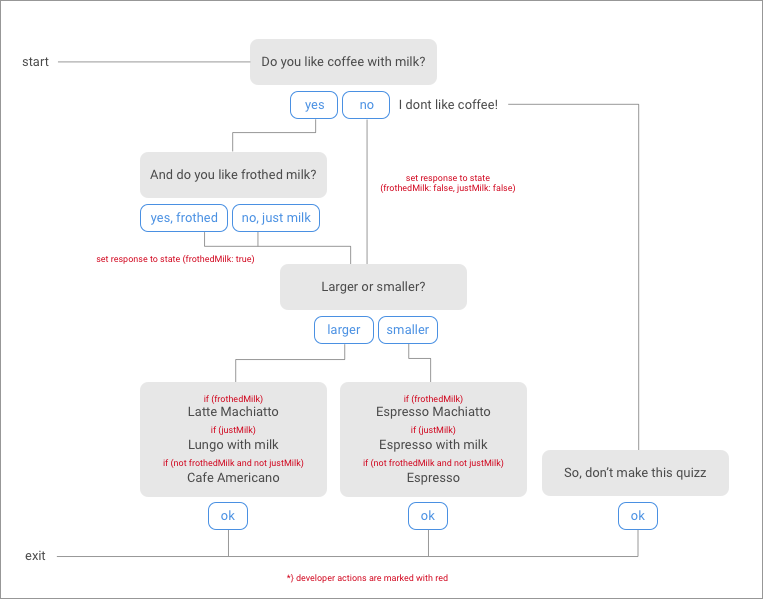
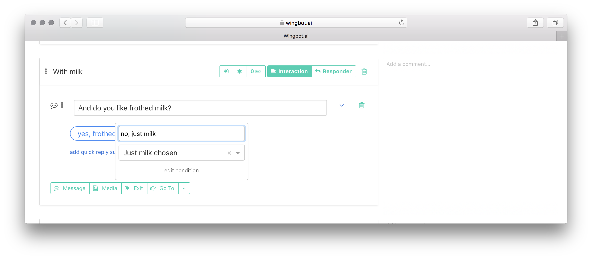

# Advanced conversation tree

Let's have this conversation tree. The purpose is simple - choose the right coffee. Here is a diagram.

1. **Add a new Conversation tree**

  - click on "add button" on bot page and name the tree "Choose Coffee"

  

  - then continue with "Edit" button

2. **Create the starting Interaction**

  - in the tree, there will be already first "entry point" - let's start here
  - add the Message box with two quick replies
  - connect "Yes" reply to a new Interaction "With milk"
  - connect "No" reply to new Interaction "Without milk"

  

3. **Make the "With milk" Interaction**

  - create the Message box with two quick replies
  - each new quick reply will need own new Interaction - "Frothed milk chosen" and "Just milk chosen"

  

4. **Create the "Coffee size" Interaction**

  - at the bottom of tree, create a new Interaction and name it "Coffee size"
  - create the Message box with two quick replies
  - each new quick reply will need own new Interaction - "Small coffee" and "Large coffee"

  

5. **Interconnect previously created Interactions with "Coffee size" Interaction**

  - create "Go to" blocks at interactions "Without milk", "Frothed milk chosen" and "Just milk chosen"
  - "Go to" links should lead to "Coffee size" Interaction

  