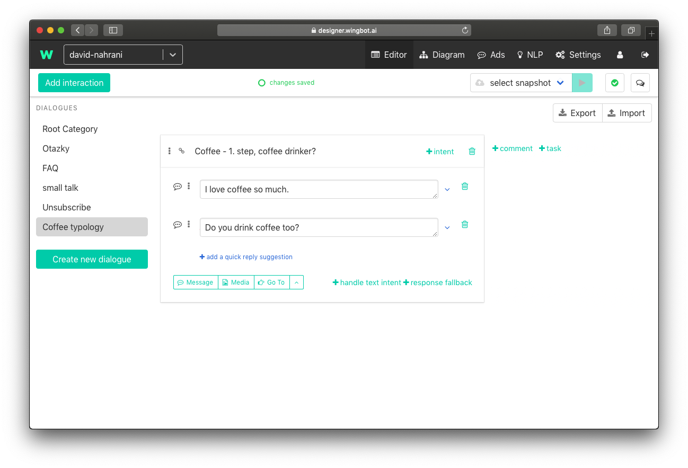
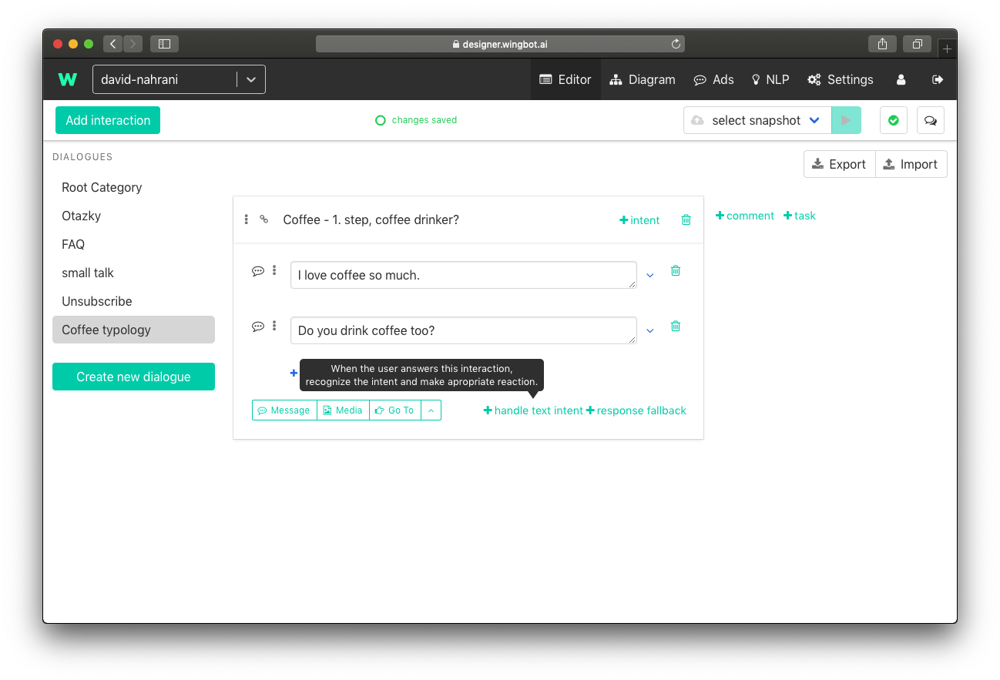
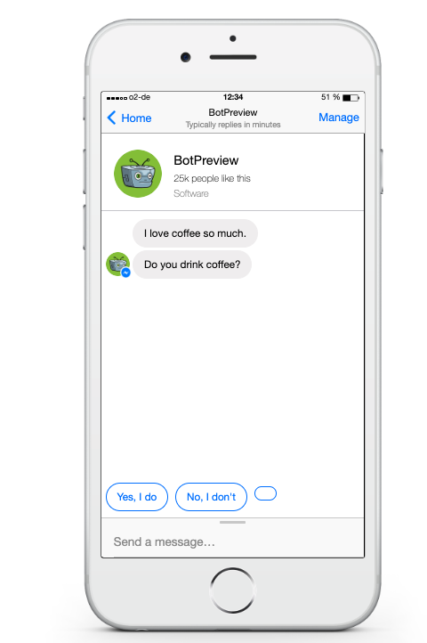

# Create Dialogue in Wingbot

We use folders for files that have something in common. We have dialogues and interactions in chatbot terminology. Dialogues are like folders and are used for interactions that are about one topic. Dialogue can be about topic "Coffee typology" and interaction is message to user "Do you drink coffee with milk?".

##Create basic dialogue with interaction

0. **Log in to wingbot**

  - Don't forget to log in :)

 

1. **Add a New Dialogue**

  We want to create simple conversation in our example. And we will talk about coffee with our user.

  Conversation tree
  

  Let's start with creation of dialogue
  + Click on the green button at left sidebar and choose name of dialogue
  + We choose "Coffee typology" for our example

  

2. **Create the First Interaction**

  To start dialogue we should start to talk with user. One "step" of conversation is interactions. 

  - Click on button at the left top corner "Add Interaction"
  - This creates empty window of interaction

  

2. **Name the First Interaction**

  Interaction name is unique and will be used for linking between interactions. We recommend to choose intuitive names of interaction, so you could find them simply later.

  - At the first step we want to know whether the user drink coffee at all. We set interaction name "Coffee - 1. step, coffee drinker?"

  

3. **Actions of the First Interaction**

  Action of interaction is something, what chatbot do. Interaction can contains text messages, tagging of users, images, ... . <!-- Referencion what can interaction include -->
  Info: Text messages should not be so long. Shorter messages are better. If you can not make message any shorter, you can divide it to more messages. 

  - We will start with adding messages - click to Message button below the name of interaction 
  - We are in casual conversation so lets talk with user like with friend. We will add two messages "I love coffee so much." and "Do you drink coffee too?"

  

  

We can start conversation with user at this point. But we can not still respond to user reply

##Handle user responses

We sent the message and user will response. He can just type the message and we should recognize it. We have two options in this case - we found coffee drinker or not.

4. **Create handler**

  - Let's think about user response.
  - Create first handler for intents by clicking on "+ handle intent" (if you can't see it try to click in wingot anywhere in interaction)

  

5. **Add intents to handler in interaction**

  - Coffee drinker will give us positive reaction. We can use "positive" to the name of intent.
  - and now we can add texts, what can user type if he is coffee drinker

  Info: Intents can be used in more interactions.

  Info: You don't have to worry about interpunction or uppercase.

  Remember: User can type with mistakes.

  

6. **Sent user to next interaction**

  We can continue with dialogue in next interactions. 

  - use "Go to" below the intents, type the name of the next interaction and click to create in dropdown.

  

7. **Handle user responses in interaction for negative responses**

  - repeat steps 4. - 6. to create handler for negative responses

  

##Quick replies of user

Quick replies provides user a reaction without typing. Reactions are prepared for user and he can easily reply by clicking on them.

Example of quick replies:

8. **Add Quick Reply**

  - Go back to messages, which we int to user
  - Under the last message is "add a quick reply suggestion"

  

8. **Text of quick reply**

  - Type the text, which can user use. We will use "Yes, I do"

  Info: Maximum length of quick reply text is 20 characters.

  

8. **Set up the quick reply "Go to"**

  - We should send user to next interaction after using quick reply. Now should we use the same interaction like in text handlers. In our example we will use the interaction for "positive" intents "Coffee - step, which coffee?"

  

7. **Prepare quick reply for negative responses**

  - repeat steps 1. - 3. to create guick reply for negative responses

  

Tadaaa! We just learned principles of building conversation.

Check your dialogue tree in Diagram (link is in main menu at the top) :)

Diagram is also easy way how to present your chatbot.
