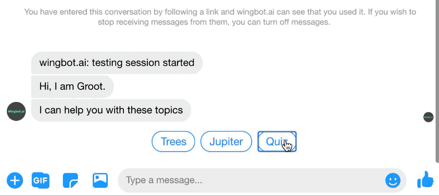
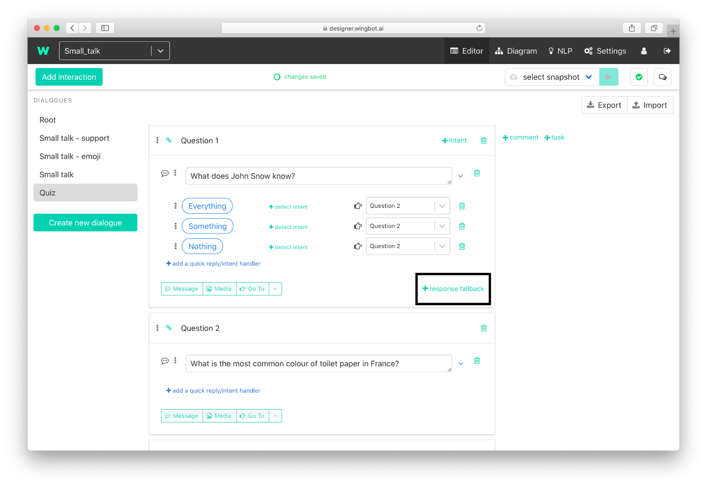

# Force user to answer the question

You can ignore the user's question (or other non-acceptable response) and ask politely him again. 

1. Click on **“+ response fallback”** on the interaction with the question.

2. Politely **ask again for the answer** and add responses too.

3. **Add a snippet, which will keep context of interaction**.

    a. Add snippet

    

    b. Move the empty snippet to the top of the fallback and select one of snippets: 
    - **“Keep user in this interaction (use it as a fallback)”** - to keep fallback.
    - **“Keep previous NLP handlers and fallback (repeatedly)”** to keep fallback and NLP handlers.

    

> You can find **more about context snippets** [here](./../HelpersForKeepingUserInContext/snippetsForContext.html).

> Take look **how contexts works** [here](./../keepUserInContext/keepUserInContext.html).
