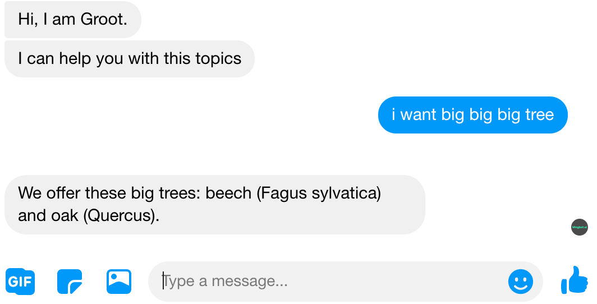
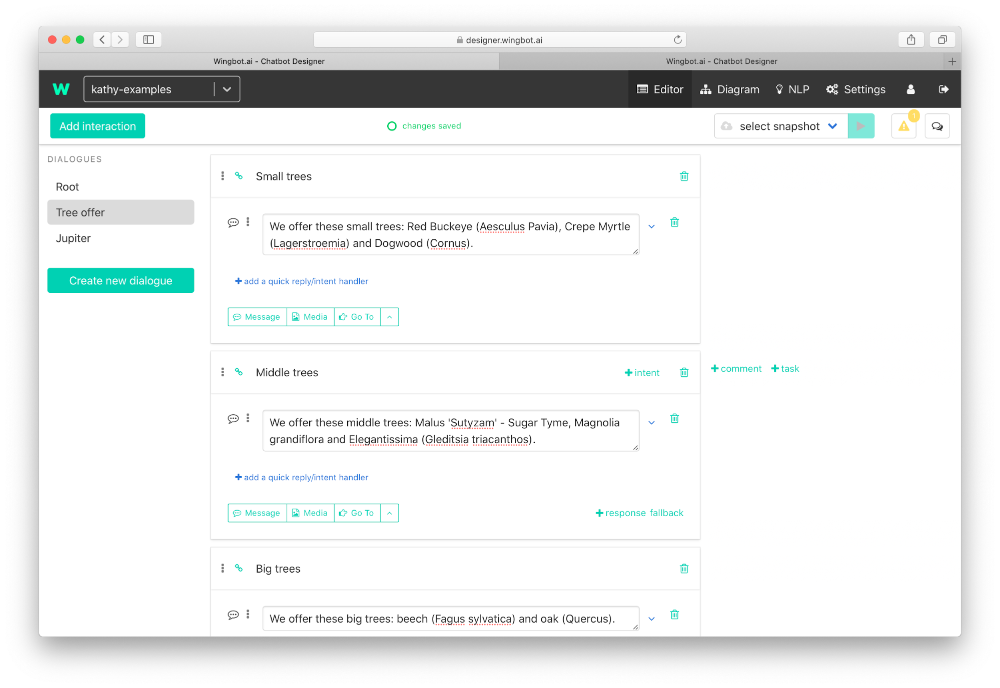
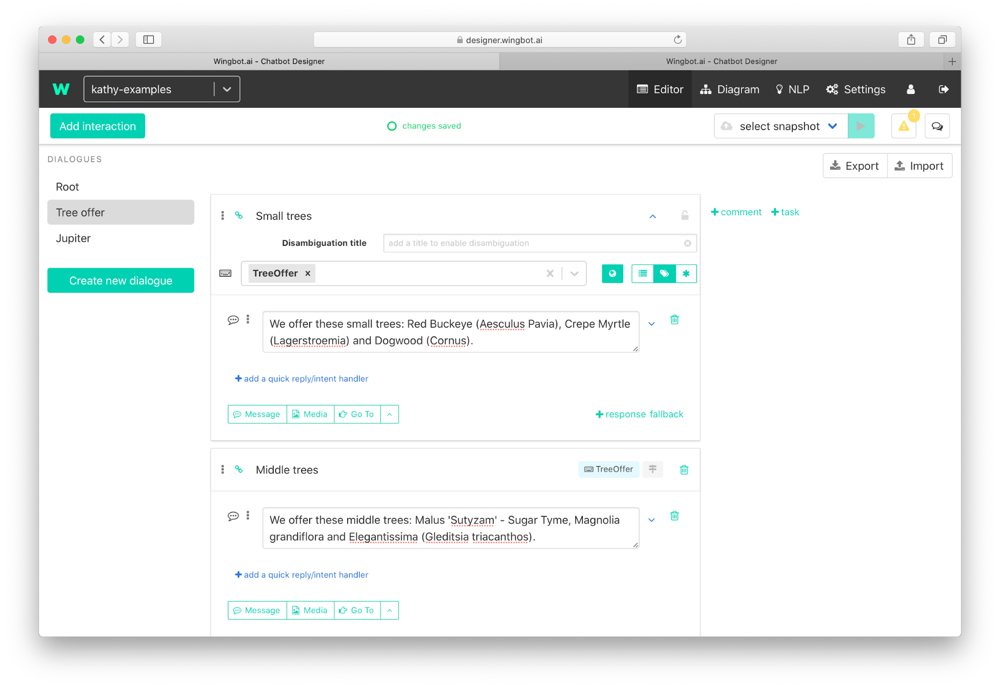
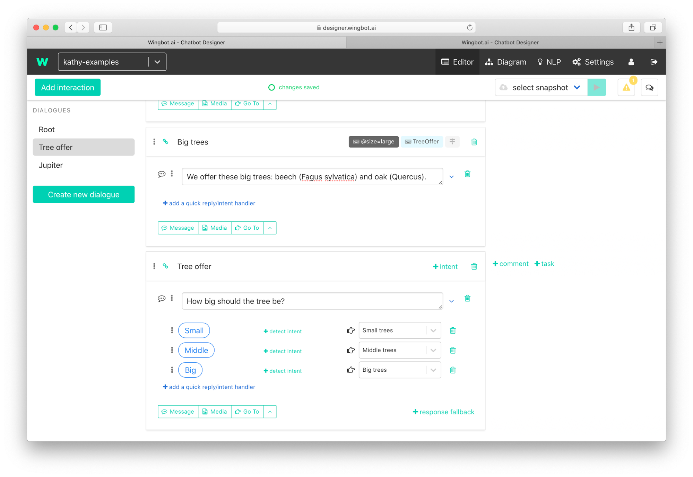
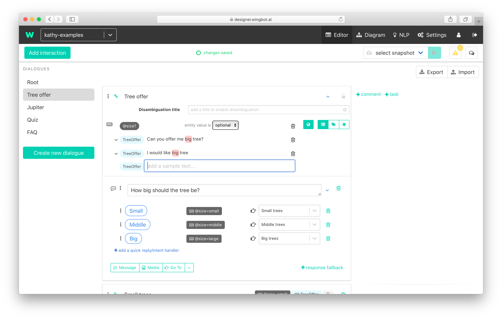
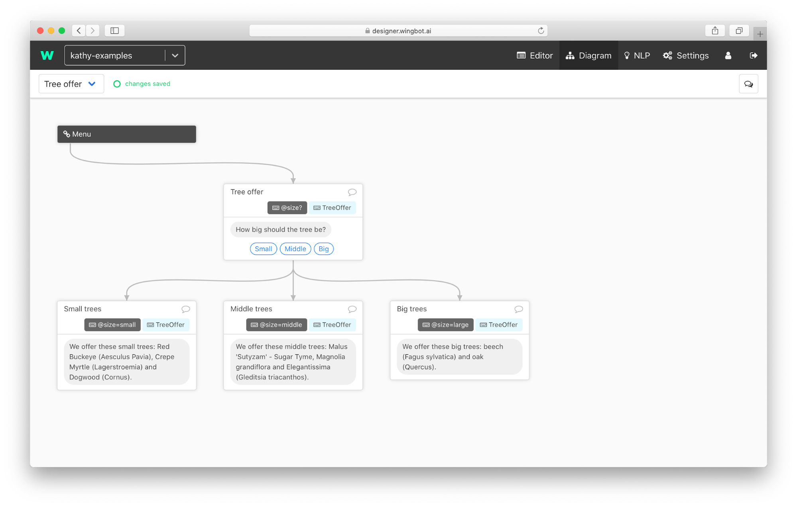

# Basic slot filling

This feature helps you easily get needed information from users. One way to get information is to ask the user little by little. The second way is that the user can type the information at once. All you need to do is have **information in the entity** and you can solve both situations easily.

**Example 1: Directly to interaction Big trees**

**Example 1: Ask for information about size**

## Slot filling with one parameter

1. **Create an entity** with information.

2. **Create intent linked to the entity**.

3. **Prepare interactions**: create interactions for small/middle/big tree offers.. 

4. **Add intent to interactions**.

5. **Add entity to interactions**.

6. **Set value of entity** (depends on the size of trees in interaction).

7. **Create interaction** which do not get the size of a tree. small/middle/big tree offers. 

8. **Add intent and entity to interaction**.

9. **Set value of entity to optional**.

10. **Add also handlers for responses.**.

### Diagram of result

