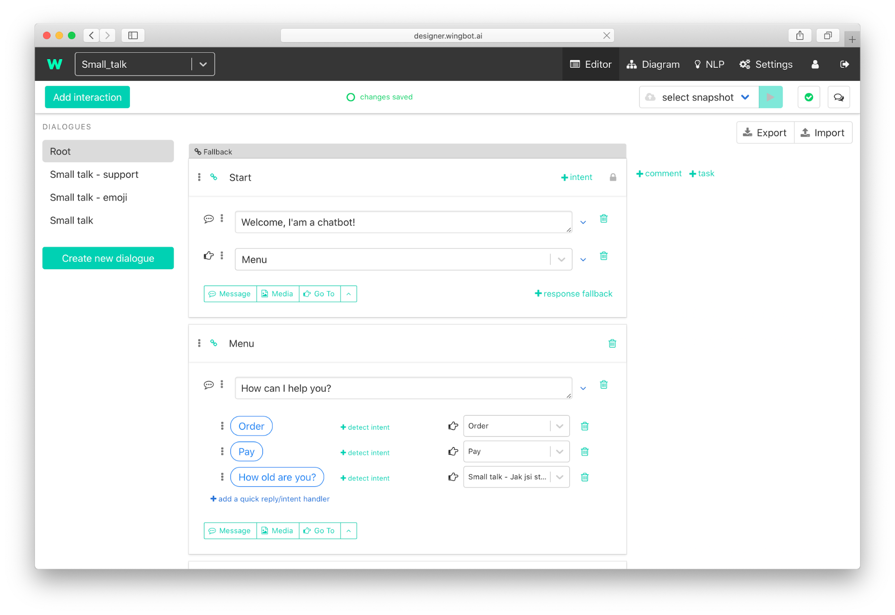
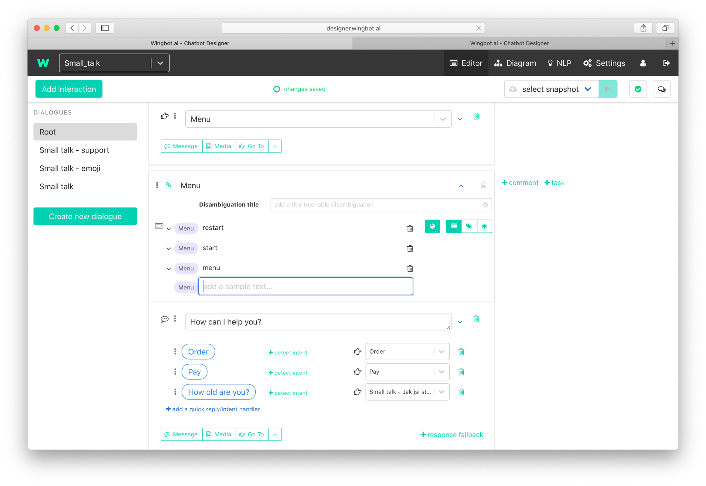
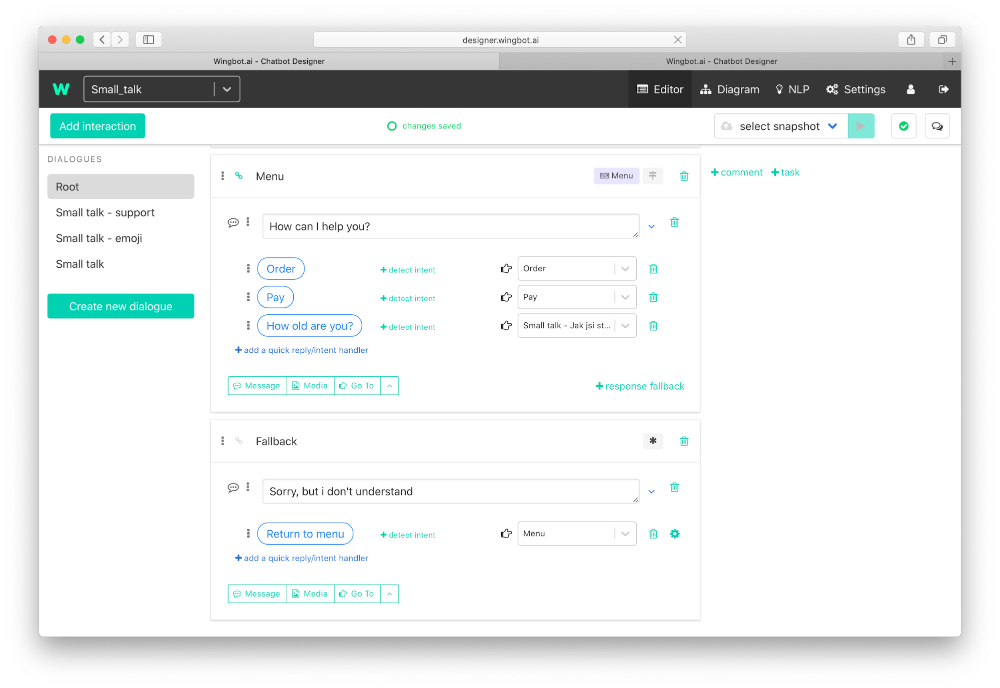

# Welcome menu as a bot’s centre part

One of many conversation patterns is for the menu of a chatbot. The menu is a specific interaction, which offers users the most used skills of a bot. It's a common mistake that the menu is included in interaction with welcome. The better way is to have it separately. 

The user can return to the menu by text or you can put it to common interactions:
- **Fallback** - users can return when they are lost.
- **End of conversation flows** - we finished use cases with users and they may be interested in other use cases.
- **Start of problems** - Users may be here by accident. This helps them to return.

## Menu for large bot

Your bot can solve so many use cases. The menu options should be easily accessed by the users - the count depends on a channel (how many options can fit there). When you have more use cases, you should **optimize the options**. The menu should include the most frequent use cases or their categories. The best practice, in this case, is to add one more option for **open questions**. Users will know that they can write what they want directly.

There is one case when you don't need a menu. That's when your bot has just single questions, where are not common topics. You can use just a **question without options** - for example “How can I help you?”

## Create specific menu interaction

1. **Separate the welcome and the menu** to different interactions.

2. **Add intent for “return”** to the menu interaction.

3. **Add a link to the menu** to common interactions.

