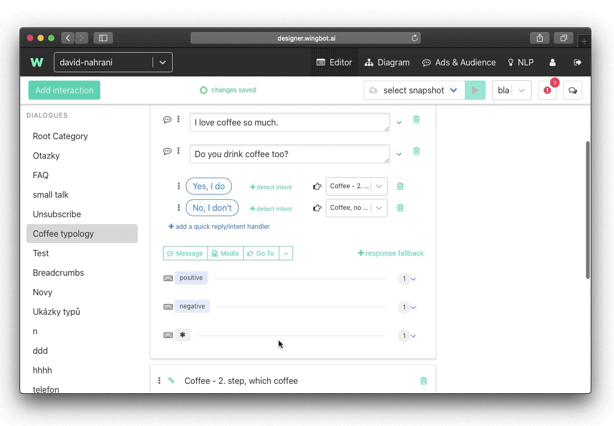
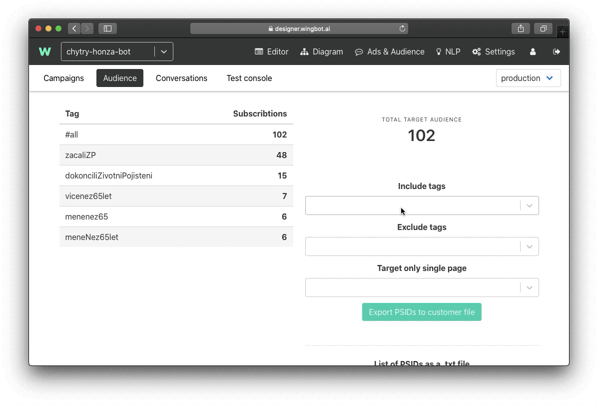
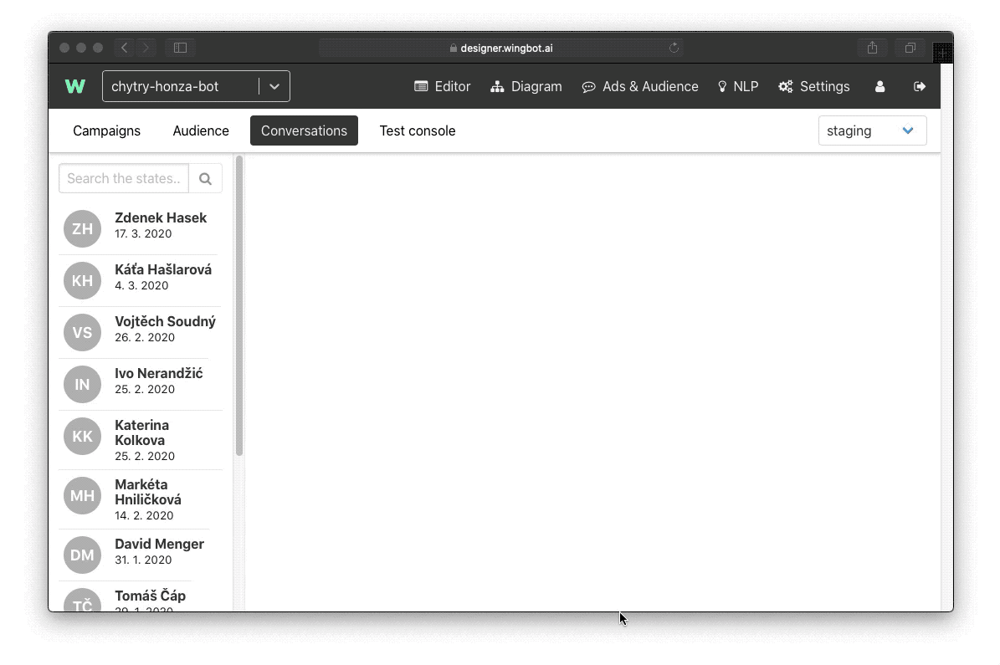

# How to create and export custom audiences

If you are designing a chatbot for the Facebook platform you might use the feature of Designer for creating custom audiences. This list of user’s ids might be used for targeting a Facebook ad. With this feature you can for example target a specific list of users that performed specific action in your chatbot.

> Tip: You might design your conversation to use those tags. You might have some point where you ask the user something out of context. For example, you ask the user whether he likes dogs or cats. You save his response and then create a specific Facebook ad for a dog or cat lovers.

**How to create an audience using tags**

For a campaign to be effective, you should target only relevant people. To ensure this be sure to insert tags to every interaction that might be significant to you.
 
Tags can be inserted like this:

Then let users chat with your chatbot for some time. After a week or two you can go to **Ads & Audience** > **Audience**:

Here you can see all the users that fit all the tags you designed.

Exporting a list of user id’s is fairly easy. Just choose which tags you want to include or exclude. Then simply click on Export PSIDs to the customer file.

A file that you will download, you can insert it directly into Facebook Ads Manager as a Custom Audience. More about how to work with Custom Audiences on Facebook, follow this link to Facebook Help. >> https://www.facebook.com/business/help/341425252616329?id=2469097953376494

Or just follow this guide:

**Importing and subscribing users to tags**

You can also reverse this process and subscribe to users manually to a certain tag. This might be useful if you decided that you should create a tag and some users already interacted with your bot and didn’t subscribed to a tag. You can find users id either in Google Analytics or in the Designer. Go to **Ads & Audience** > **Conversations**:

Copy and paste all the user ids that you like to a text file. And then import it to the Designer:

