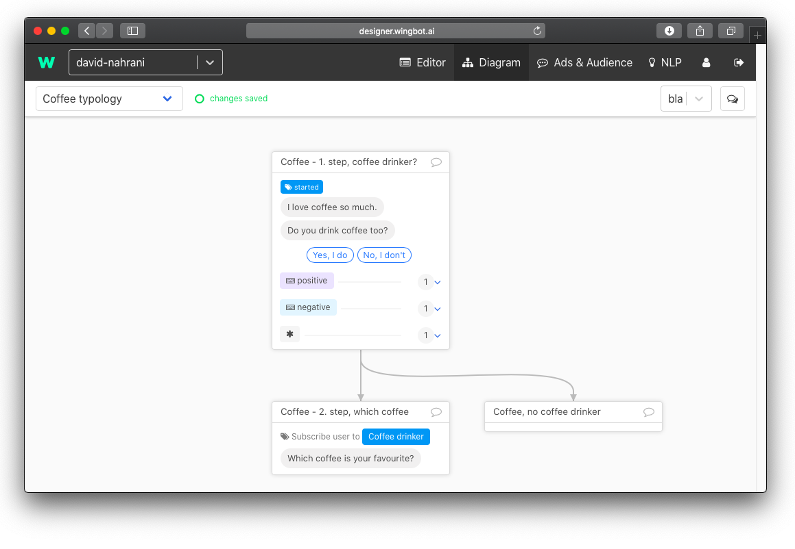
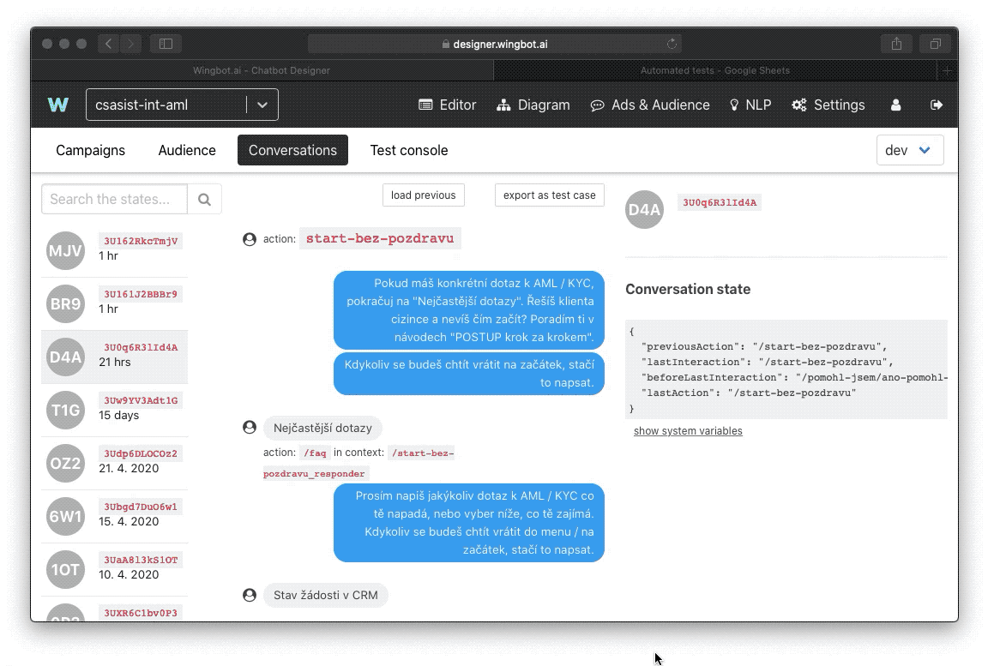

# Automated tests for conversations

Before you publish your chatbot and send it to the world you want to be more than sure that it is working properly. Beside NLP (which you will still tune even weeks after release) and language correctness you have to be confident that all interactions are wired somewhere so that users won’t end up in a dead end. There is a feature in Designer that will help you go through all the steps of your chatbot. We call it automated tests for conversations.

Automated tests can help you with:
- Problems with NLP
- Dead ends in conversations
- Missing Quick replies

Besides that automated tests also help you with releasing new versions of your chatbot. That means that if you change something in your chatbot (for example change of connection between interactions or connections to new interactions), it can easily happen that you forgot to wire all interactions. At this moment, you can execute an automated test and it will show you where you forgot to put some connections.

**Technical preparation**

The idea behind automated tests is to go automatically through all the interactions in the chatbot and try to simulate every path users can go through. To do this you will export all the possible paths into Google Sheet and then start an automated test in the Designer. 

So the first step is to create a Google Sheet that you should link to your chatbot. You can download a template here. Structure will look like this:

What does all the columns mean?

- **Testcase** - name of the test (path)
- Testcase type - here you can note yourself if the test case is done through NLP or Quick replies
-  Input description - This a space for your description of the input
- **User input text or #interaction-path** - here you can write either text input or name of the button on a quick reply
- **First interaction path of chatbot response** - that is a interaction path to the interaction
- **Chatbot text reactions contains** - actual content of the interaction
- **Quick replies texts contains** - what quick replies are available to user

Columns highlighted in bold are mandatory.

How to connect this Google Sheet with your chatbot is mentioned in our technical documentation.

As we mentioned you should follow every possible path users can take. Every path should have its own name mentioned in the Testcase.

In the next step, we suggest printing a diagram of your chatbot, so that you are sure that you will not forget any interaction.

Then start to walk through all the interactions in all dialogues using quick replies at first. When you walk through the interaction, make a mark on your printed diagram. Like that you won’t forget any of them.

Then go to **Ads & Audience** > **Conversations**. Then find the conversation you just did and then click on **Export as test case**. This will copy the whole conversation into your clipboard. Then go back to the Google sheet you created and paste the Testcase from your clipboard.

After pasting, Google Sheet will look like this:

Another important thing is that if you insert a blank row, Designer will automatically skip everything that is below this blank row.

**How to perform a test**

Then go back to the **Designer** > **Ads & Audience** > **Test console**. Here click on **Execute test**.

Also be sure on which snapshot you are performing the test.

**How to evaluate results of a test**

Every test case will show after finishing as a new line. 

You can encounter different types of errors:

- Expected action didn’t happen
- Expected text didn’t occur (text is different than expected in the given interaction)
- Expected Quick reply not found

Designer will also show you at which step your bot failed. It is easy to go back to the Google Sheet and find a row where chatbot failed. Try to troubleshoot what went wrong.