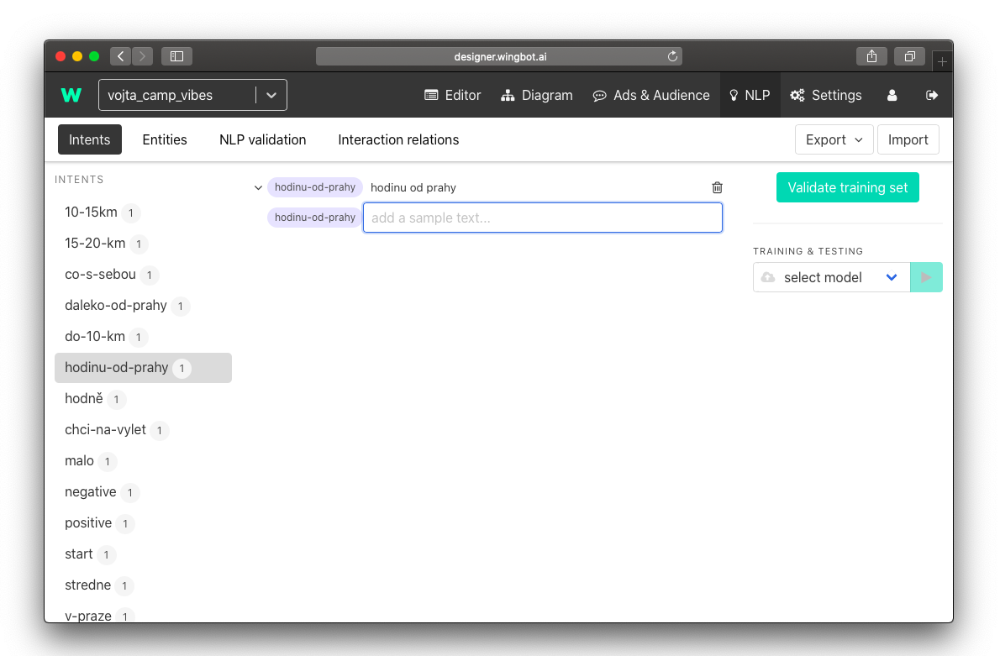
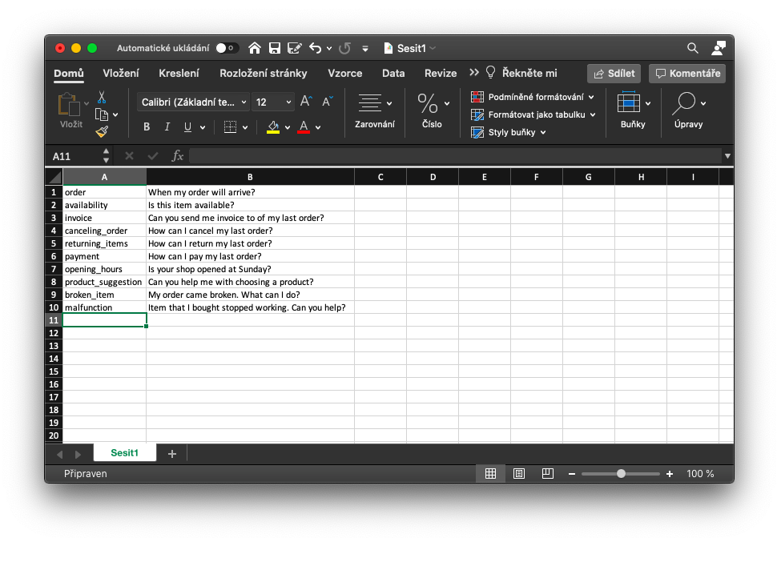
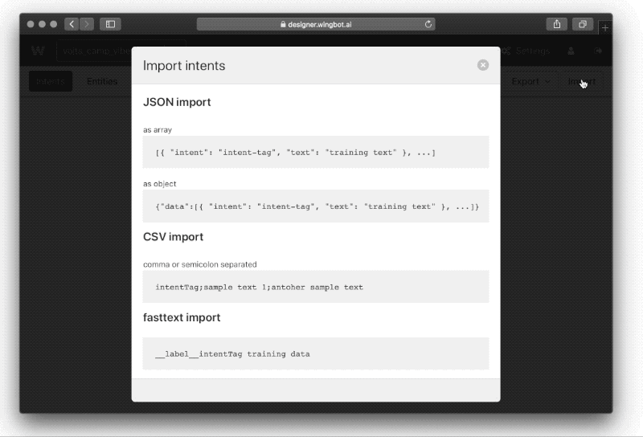

# Best practice how to start with NLP in a new chatbot

When you are starting with a new chatbot you might wonder what is the best way to start with creating intents for natural language processing (NLP). 

You might have the experience that after some time of testing your new chatbot you realize that some intents collide and that some utterances don't lead to a desired intent (or more precisely to a desired interaction). There is a way to avoid it.

**Training data overview with only one utterance per intent**

In our experience the key is to have a bigger picture of all intents you will use in the chatbot. With this overview you might see some collisions or proximity of the anticipated intents easily. With this knowledge you can decide which intents should be merged or that some intents might be divided into two separate ones.

How to ensure this? We suggest that you create **all the intents** to all the interactions **at the very beginning, before feeding the NLP with samples**. 

You can do it directly in the Designer, but for the bigger picture, we suggest that you use an Excel sheet to see all the desired intents at one page. 

> As you can see there are multiple rows with similar utterances (Canceling order, Returning items, Payment). This is an indication for you, that you should strengthen intents that might NLP appraise as the same.

After you come up with all the intents, export this table to CSV as you can import this sheet directly to Designer after.

**Dealing with intent collisions**

What could be some examples of colliding intents? Imagine that you are designing a customer care chatbot that should be helping customers with their complaints or inquiries. At the beginning you decided that you will have interaction for **orders**. But when you see this bigger picture you might realize that people will ask distinct questions. They might ask:

- State of their order
- How to cancel the order
- How to change the order

These are all very different queries so you might want to divide this one big intent into several ones.
