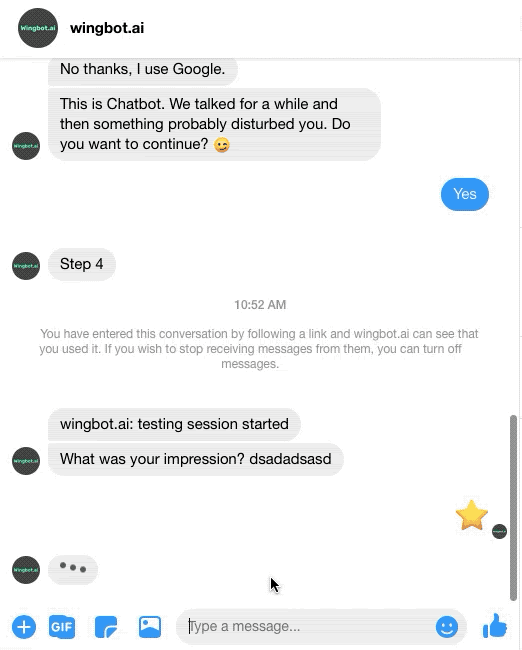
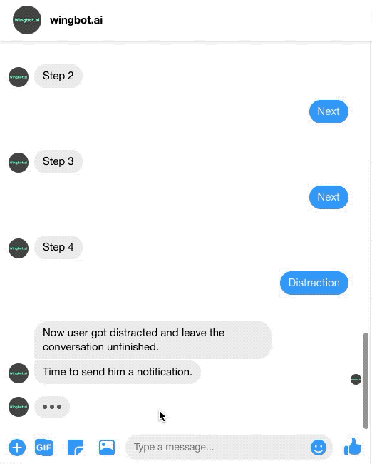
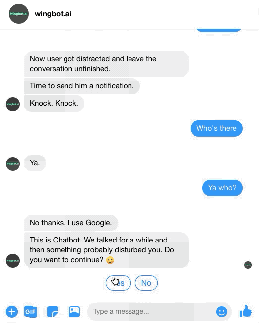
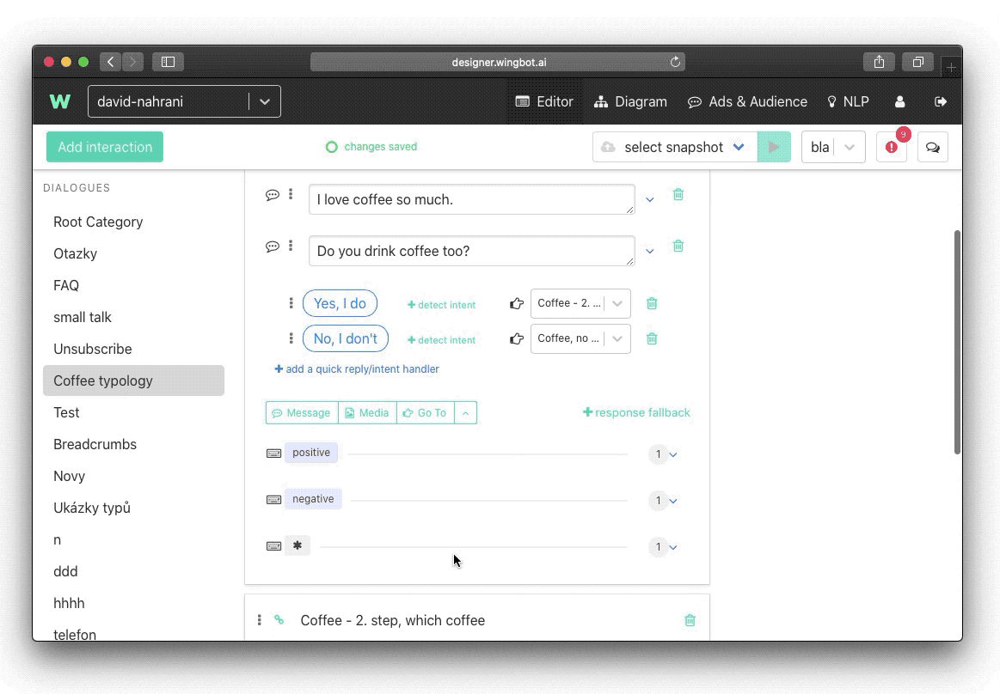
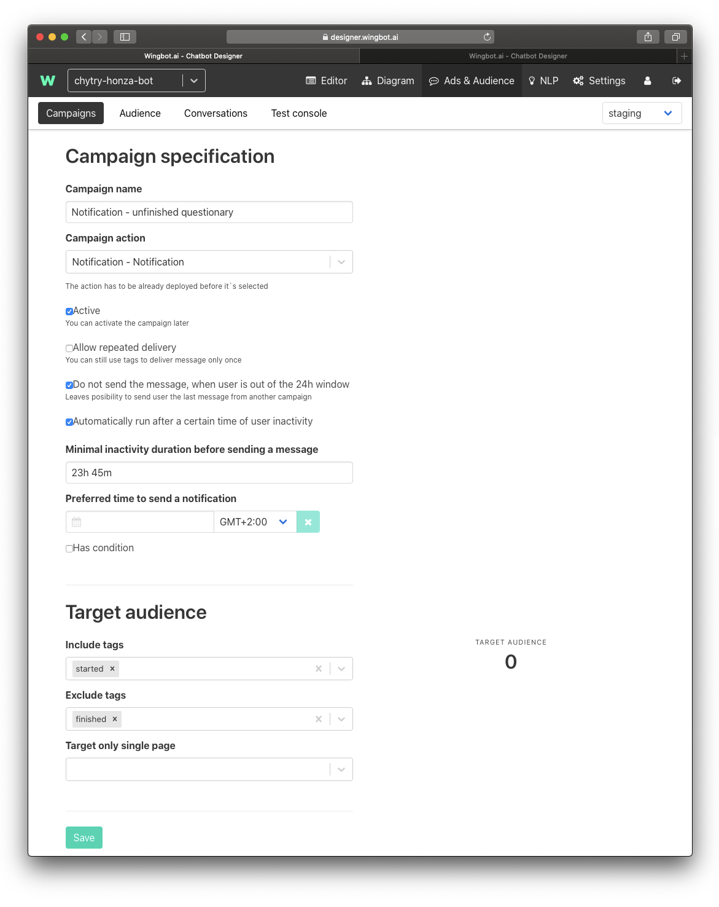

# Returning user to chatbot after some period of inactivity

Sometimes designers can lose users in the procedure of their chatbot. Something might distract the user - a phone call, his children running around, a colleague asking for help. Or maybe he just doesn't have time to chat at the moment.

There is a possibility to send one-time notification to the user in a 24-hour window after his last interaction so that you return the user where he dropped out. As it is your only possibility to contact users, this Notification conversation should be short, funny, and catchy.

**Designing Notification dialogue**

First, create new dialogue and name it Notification (but you can choose whatever name you like). Write 4 or 5 steps dialogue and at the end ask the user if he wants to continue with the process.

> In another guide, we explained, how breadcrumbs work. So put breadcrumbs everywhere, where you might lose users and want to put him back.

For example, when you are explaining something to a user, you could want to put him back in the last step that he read. Or maybe you are trying to get contact from a user and he already gave you his name. So you don't want to ask him again and put him directly to subsequent questions.

So at the end of Notification dialogue insert an interaction that will put the user back to the last interaction he visited.

**Targeting relevant users**

Another very important thing is that you should target only relevant users. To ensure that, use tags. 

Tags can be inserted like this.

Insert one tag at the second interaction (so that you are sure that you capture users that started the conversation). And second tag to the end of the conversation so that you avoid those, who finished your chatbot procedure.

**Setting up a campaign**

Now as you have your conversation ready it is time to set up a campaign. You can find Campaigns in the Ads & Audience section of the Designer. Now let’s dive into all the parameters, you can choose in campaign setting:

Campaign specification
- Campaign name - pretty self-explanatory
- Campaign action - where the campaign should lead
- Active - tick it, if you want your campaign to be active right away
- Allow repeated delivery - this option will secure that one user will receive this notification only once
- Do not send the message when the user is out of the 24h window - this option should help you with the 24h window on Facebook we mentioned at the beginning
- Automatically run after a certain time of user inactivity - with this option you can select after which period of user inactivity you will send notification

Target audience
- Include tags - in this option, you can choose which audience you want to target (see above)
- Exclude tags - with this option you can specify, what audience you want to exclude (for example users that finished procedure)
- Target only single page - one chatbot can be connected to multiple Facebook pages, with this option, you restrict sending a notification to only on a selected one

As you will have all the necessary things set up, just save what you did. Your notification is now ready to launch. Once you activate it, you can track its performance.

