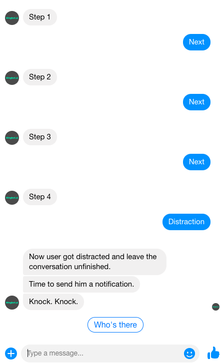
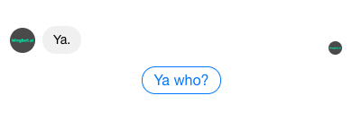
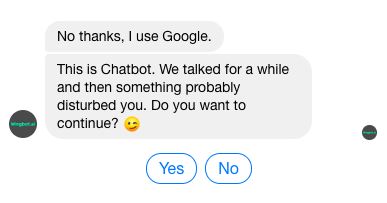
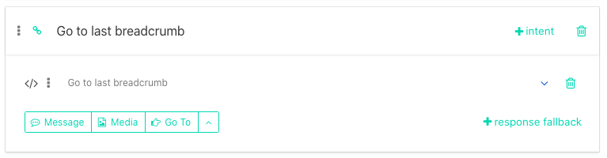
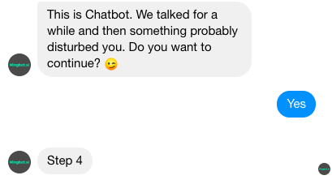
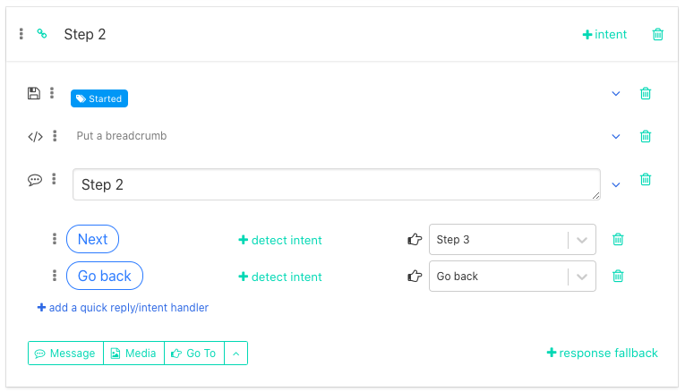
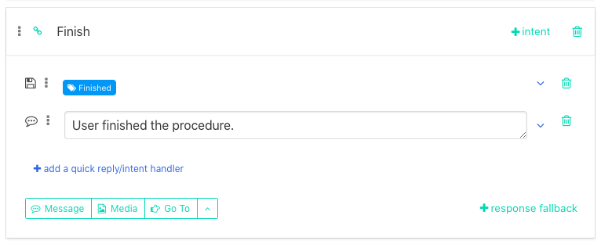

# Sending notifications

One of the many features, that Wingbot offers is a possibility to send notfications to users. This feature will appreciate those who are designing a step-by-step chatbot. 

For example you can explain some process or procedure and each step is described in one interaction.

Other step-by-step type chatbot might be a lead generating type of chatbot. In a step-by-step part of the conversation you are asking user to give you his personal data.

In both cases you want that user finish the conversation till the end. But what if user got distracted - a phone call, his children running around, collegue asking for a help? What if he just doesn't have time to chat at the moment?

In Designer, you can notify an user and try to put him back, where he left off.

**2. New rules of Facebook notifications** 

Before we dive into this issue, let's describe some of the changes that happened recently. Since March 2020 Facebook tightened their policies toward chatbots. With those new rules businesses will have only 24 hours window to contact user and only with one message. Outside this time span you are unable to contact user directly.

You can find more information about Facebook policy towards chatbots here >> https://developers.facebook.com/docs/messenger-platform/policy/policy-overview/

**3. How to start a conversation with notification.**

As we explained chatbot designers have one and only possibility to send just one notification to users. So you should put a maximum effort in designing it to capture users attention and persuade them to respond you. 

Conversation migh start with a joke. It might be funnny in another way. It should be short and catchy. 

In 4 or 5 steps ask user if he wants to continue with the process.

**4. Using breadcrumbs**

Now to the technical part. To have things more in order we suggest that you create new dialogue and name it Notification.

In other guide, we explained, how breadcrumbs work. So put breadcrumbs everywhere, where you might loose user and want to put him back.

> For example when you are explaining user something, you could want to put him back in the last step that he read. Or maybe you are trying to get contact from a user and he gave you already his name. So you don't want to ask him again and put him directly to subsequent question.

So at the end of Notification dialogue insert an interaction that will put user back to the last interaction he visited.

Then the conversation continues with following:

**Targeting relevant users**

Another thing you should keep in mind is that you want to send notification only to relevant users. That means only to those who started chatting with your chatbot but at the same time you want to leave out those, who already finished the procedure.

To achieve this, you can tag users that have visited certain interactions. We suggest that you insert one tag at the beginning of the whole chatbot - put a tag to a second interaction of your chatbot, so that you filter those who just opened your chatbot and didn't take any action.

Put a second tag to the end of a procedure - when you have all the personal data you want or when user finished the procedure.

**Setting up a campaign in Designer**

Now as you have your conversation ready it is time to set up a campaign. You can find Campaigns in **Ads&Audience** section of the Designer.

First name your campaign. In the next step you choose to which interaction should notification lead. 

As we mentioned at the beginning, Facebook changed its rules so tick an option Do not sent the message, when a user is out of the 24h window.

Next you choose which people chatbot should target with the Notification (as mentioned in the previous step).

**6. How to test if your notification is ready to use**

Before you publish your chatbot you should be sure that you set up your notification correctly. To ensure this, you might test it on Staging snapshot. Try to copy your Notification on Staging. Then test your chatbot on Staging and wait if a notification occurs.