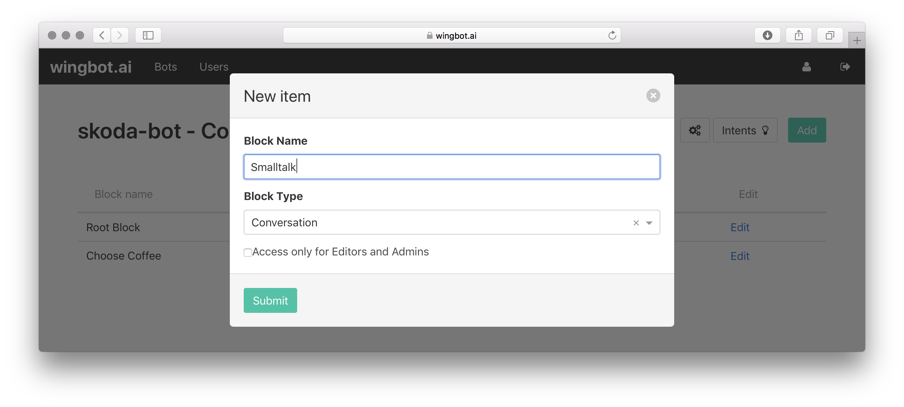
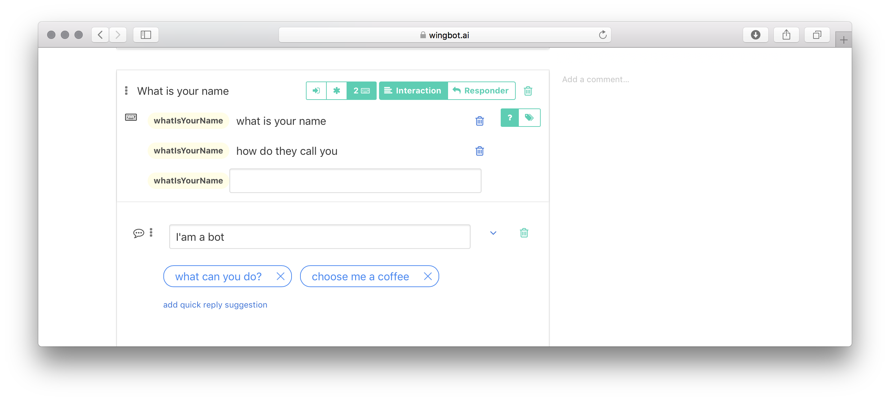

# Making Smalltalk conversation tree

Smalltalk conversation pattern use usefull, when you want to cover a large number of user questions with a simple answer.

**Q:** what is your name
**A:** I'am a bot
  - *what can you do*
  - *choose me a coffee*

**Q:** what can yo do
**A:** I can find you a coffee beverage
  - *what is your name*
  - *choose me a coffee*

It's good to keep conversation flow, so it's always good to offer quick replies.

1. **Create a new Conversation tree called "Smalltalk"**

  - click on "Add" button and call the tree "Smalltalk"

  

2. **Create a first interaction: "What is your name"**

  - add new interaction and call it "What is your name"
  - add a Message response and set it's text: "I'am a bot"
  - let's add a Quick reply "what can you do" leading to a new interaction "What can you do"
  - and let's add a Quick reply "choose me a coffee" leading to a new interaction "Choose me a coffee"

  

3. **Fill a send interaction: "What can you do"**

  - interaction "What can you do" has been created in previous step when creating a Quick reply
  - add a Message response and set it's text: "I can find you a coffee beverage"
  - let's add a Quick reply "what is your name" leading to a the interaction "What is your name"
  - and let's add a Quick reply "choose me a coffee" leading to a the interaction "Choose me a coffee"

  

4. **Create Intents and write down sentence examples**

  - at both of theese two interactions, click the "keyboard" button and write down examples - sentences, which takes user to theese interactions

  

5. **Make the exit interaction - "Choose me a coffee"**

  - put a new Exit Block into the interaction "Choose me a coffee" and call it "Choose coffee"

  

6. **Include the "Smalltalk" conversation tree in the Root Block**

  - go to "Root block" at the bot's homepage
  - create a new interaction and move it after "Start" interaction
  - name it "Smalltalk" for example
  - insert an "Include" block into the interaction and choose "Smalltalk" subtree
  - now you can configure exit point "Choose coffee"
  - for example, send a message and redirect user to "Choose coffee" interaction
  - **Important: **by clicking **the Asterisk** make this interaction to intercept all communication

  

## How it works?

