# Advanced conversation tree

Let's have this conversation tree. The purpose is simple - choose the right coffee. Here is a diagram.

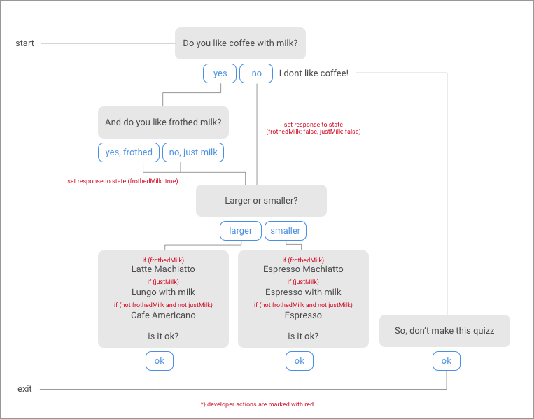

1. **Add a new Conversation tree**

  - click on "add button" on bot page and name the tree "Choose Coffee"

  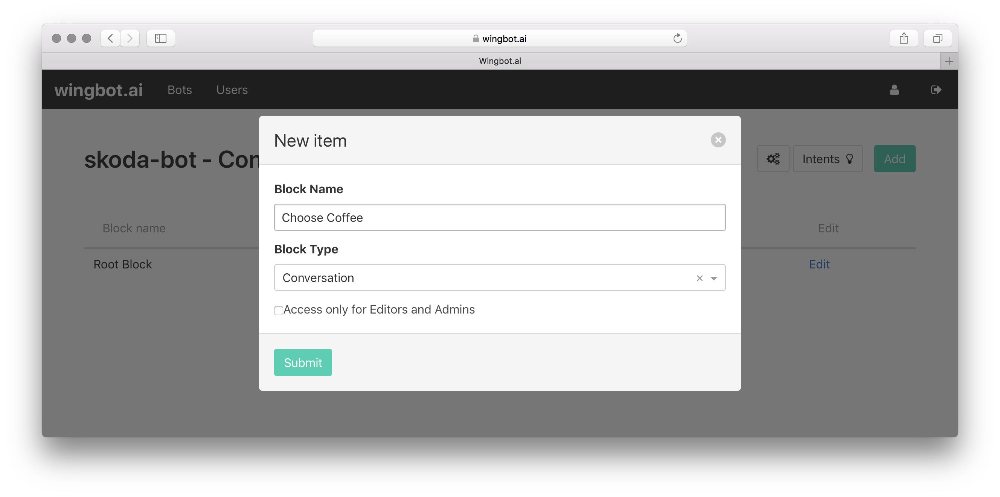

  - then continue with "Edit" button

2. **Create the starting Interaction**

  - in the tree, there will be already first "entry point" - let's start here
  - add the Message box with two quick replies
  - connect "Yes" reply to a new Interaction "With milk"
  - connect "No" reply to new Interaction "Without milk"

  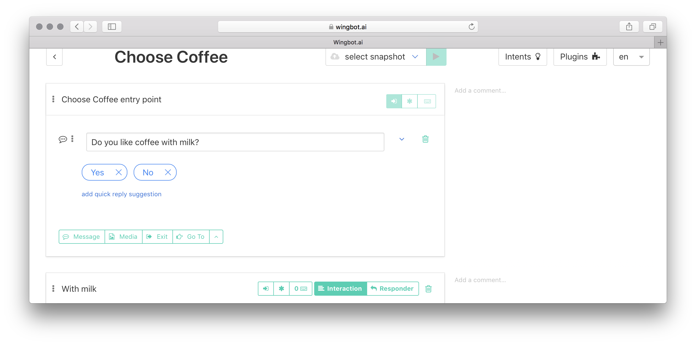

3. **Make the "With milk" Interaction**

  - create the Message box with two quick replies
  - each new quick reply will need own new Interaction - "Frothed milk chosen" and "Just milk chosen"

  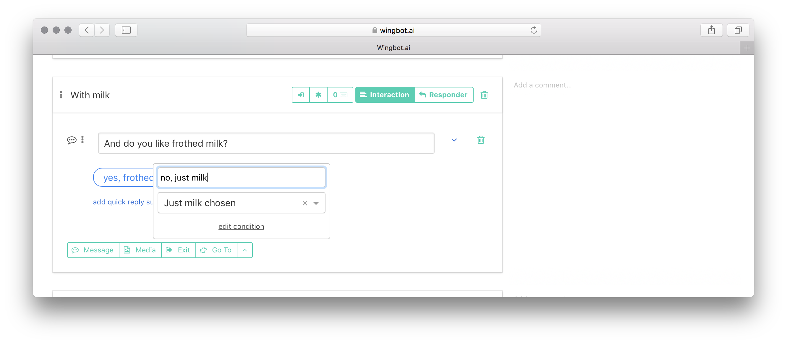

4. **Create the "Coffee size" Interaction**

  - at the bottom of tree, create a new Interaction and name it "Coffee size"
  - create the Message box with two quick replies
  - each new quick reply will need own new Interaction - "Small coffee" and "Large coffee"

  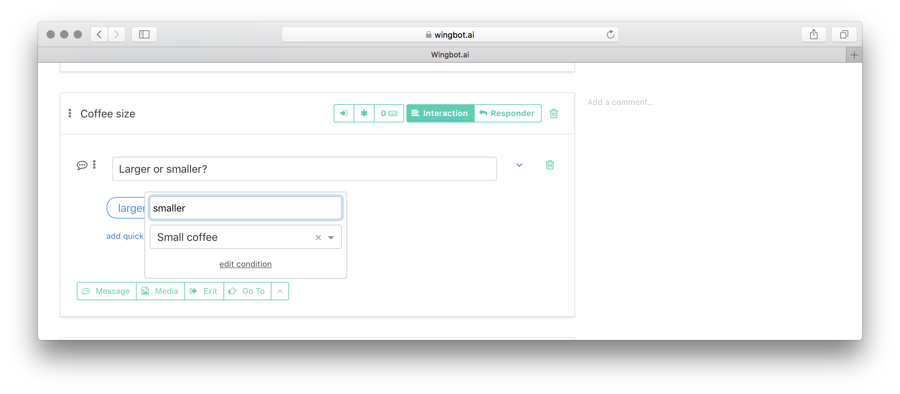

5. **Interconnect previously created Interactions with "Coffee size" Interaction**

  - create "Go to" blocks at interactions "Without milk", "Frothed milk chosen" and "Just milk chosen"
  - "Go to" links should lead to "Coffee size" Interaction

  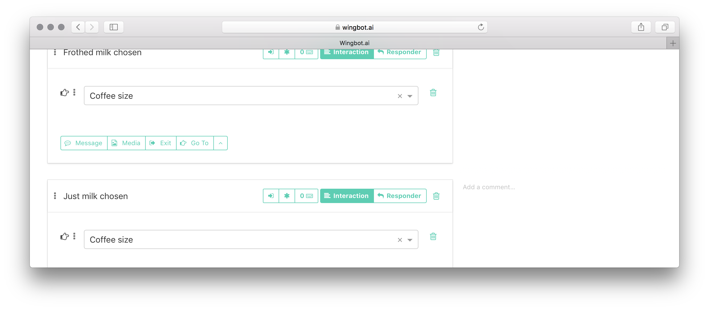

8. **Create the exit interaction - "Finished"**

  - call it "Finished"
  - put a new Exit Block into the interaction and call it "User leaved"

  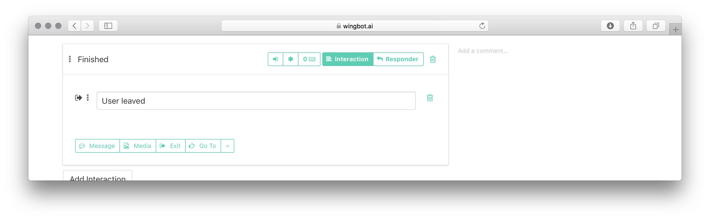

7. **Fill the "Small coffee" and the "Large coffee" interactions**

  - insert texts, which will be conditionally shown (three for each card)
  - insert "Is it ok?" call to action with "Ok" quick reply leading to newly created "Finished" Interaction
  - point "Ok" quick reply to "Finished" interaction with previously defined exit point.
  - now, messages will be sent sequientially - it's required to let developer set conditions

  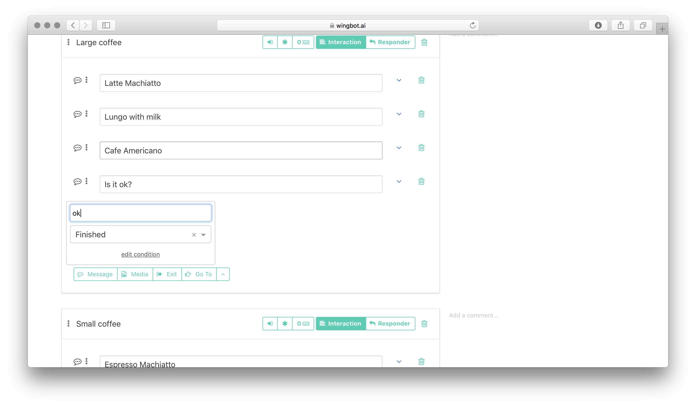

8. **FOR DEVELOPERS: set responses to state**

  - there are three interactions within the state has to be set: "Without milk", "Frothed milk chosen" and "Just milk chosen"
  - put a "snippet" in each of theese interaction
  - decribe a snippet as much as descriptive: "set withMilk to conversation state"
  - fill the snippet with following code

  ```javascript
  (req, res, postBack) => {
      res.setState({ withMilk: false, frothedMilk: false });
      return Router.CONTINUE;
  }
  ```

  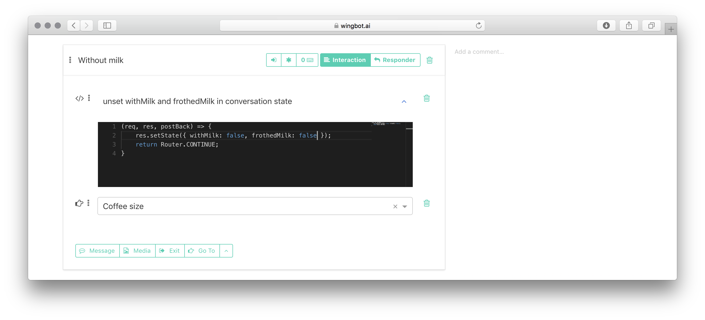

9. **FOR DEVELOPERS: set up conditions for messages**

  - each message can be conditionally shown or hidden
  - to enable condition, use carret beside the message box to show a "has condition"
  - use this snippet as condition

  ```javascript
  (req, res) => {
      return !req.state.withMilk && !req.state.frothedMilk;
  }
  ```

  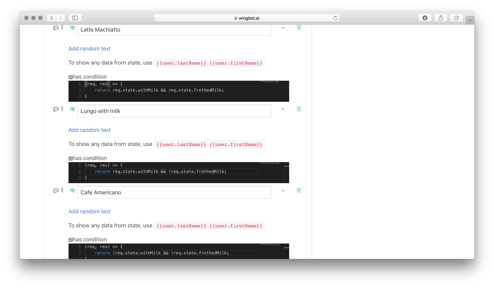

10. **Create an alternative response "No coffee at all"**

  When users are asked, whether they prefer milk or not and responses they do not like coffee.

  - make a new interaction and drag it below the "Choose Coffee entry point" - it's better to keep interactions organised
  - toggle the switch to **Responder**
  - choose "Choose Coffee entry point" as **Reaction to**
  - click the "Keyboard" button and write examples of user's message: "do not like coffe", e.t.c.
  - insert a Message interaction and point "ok" answer to "Finished" interaction

  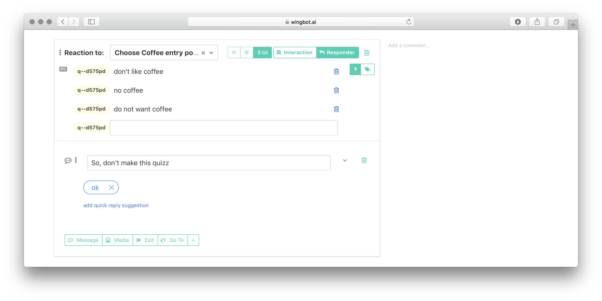

11. **Include the "Choose coffee" conversation tree in the Root Block**

  - go to "Root block" at the bot's homepage
  - create a new interaction and move it before "Fallback", when there is one
  - name it "Choose coffee" for example
  - insert an "Include" block into the interaction and choose "Choose coffee" subtree
  - now you can configure exit point "User leaved"
  - for example, send a message and redirect user to "Start"

  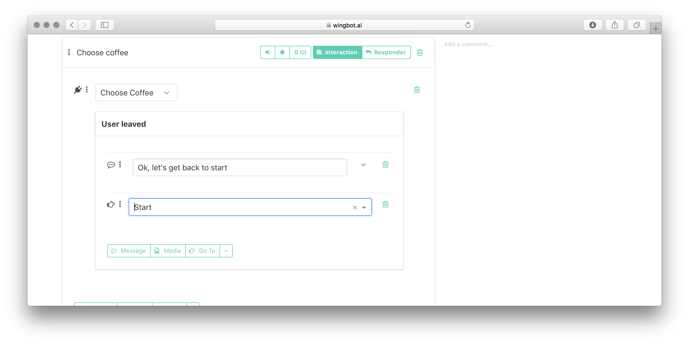

12. **Make interaction accessible by AI & from Start**

  - now you can make a new Quick reply at start and point it to "Choose coffee" interaction
  - you can also use Keyboard button and create the new intent by filling example texts like "choose me a coffee"

  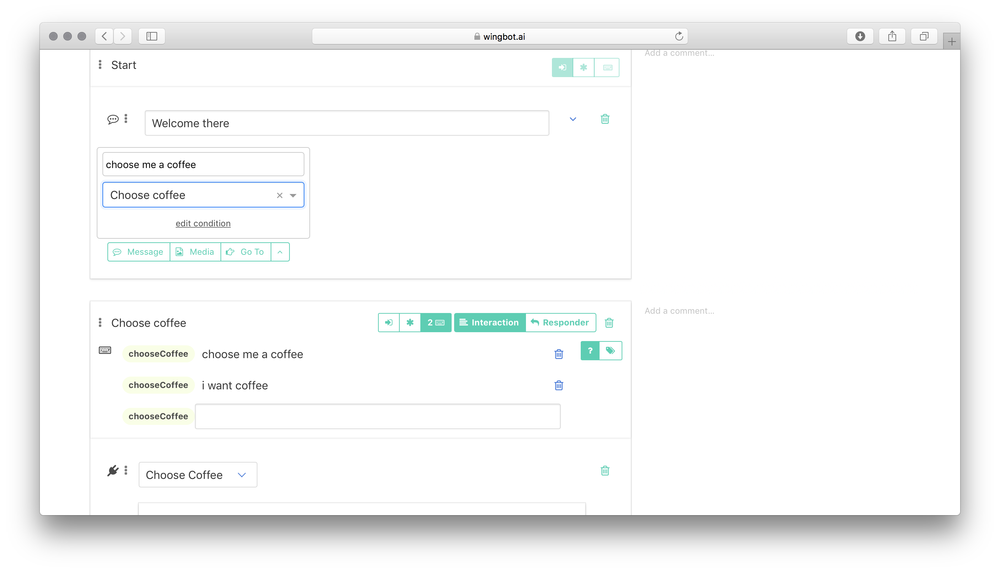

## How it works?

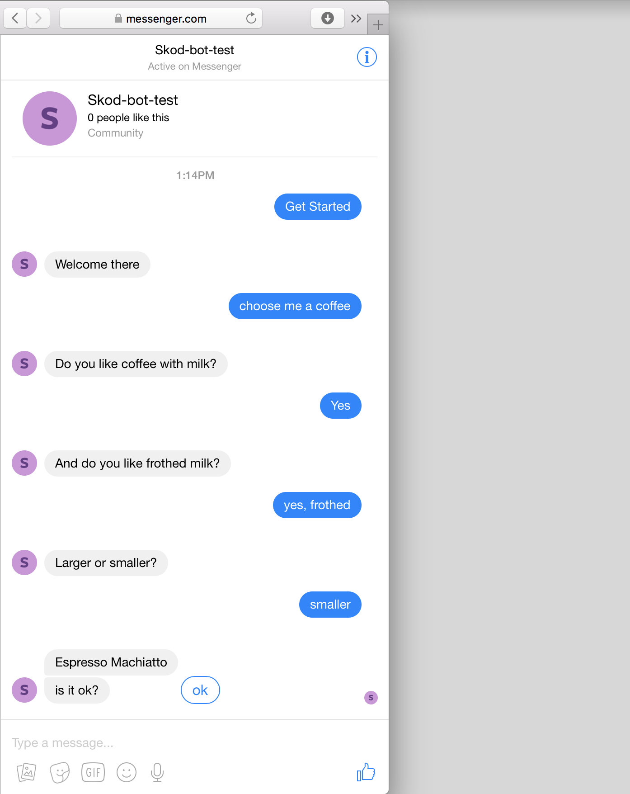