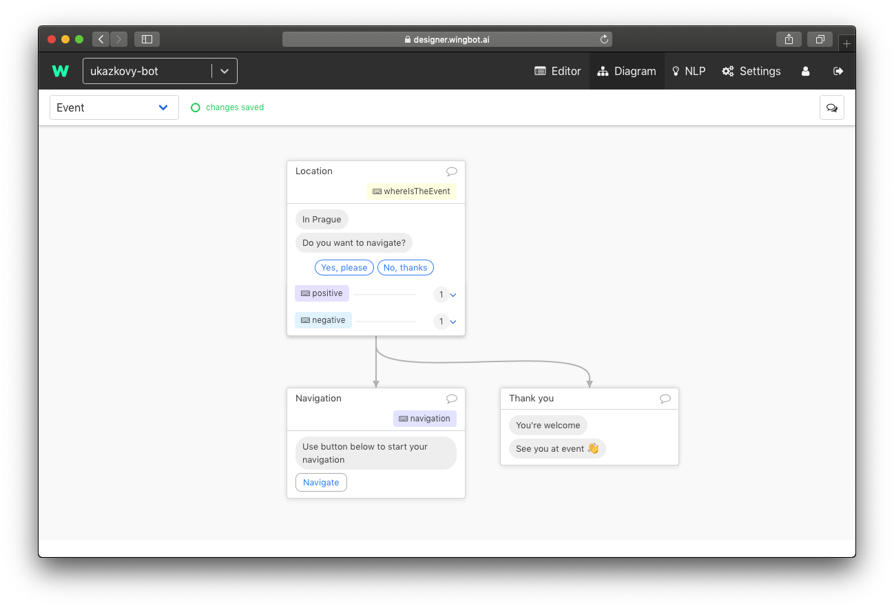
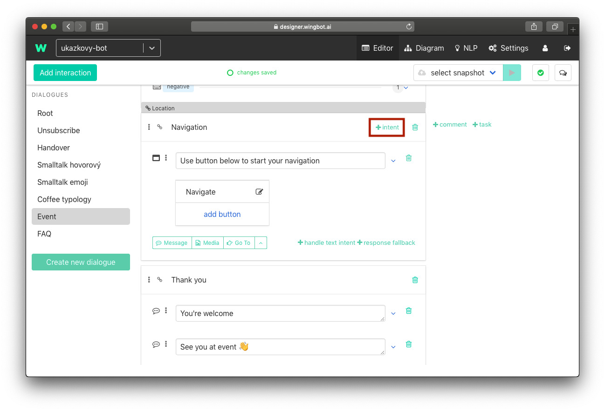
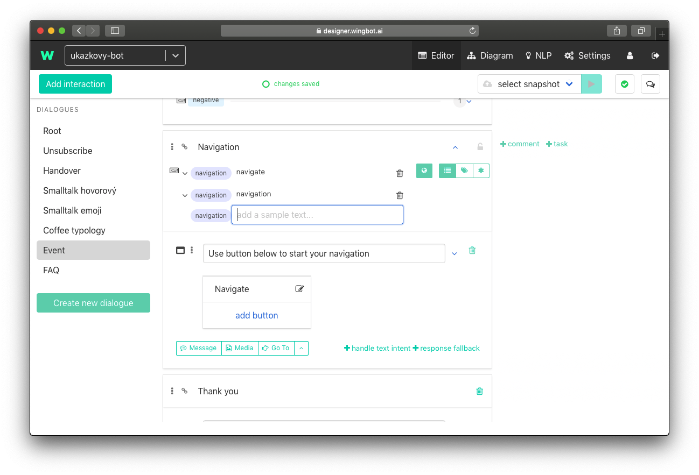
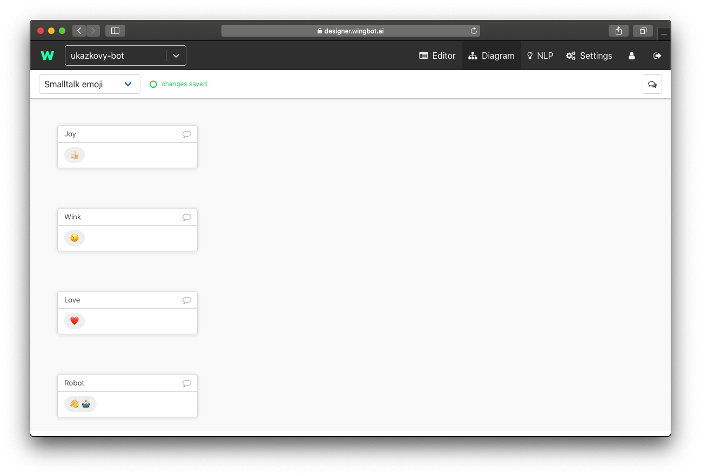
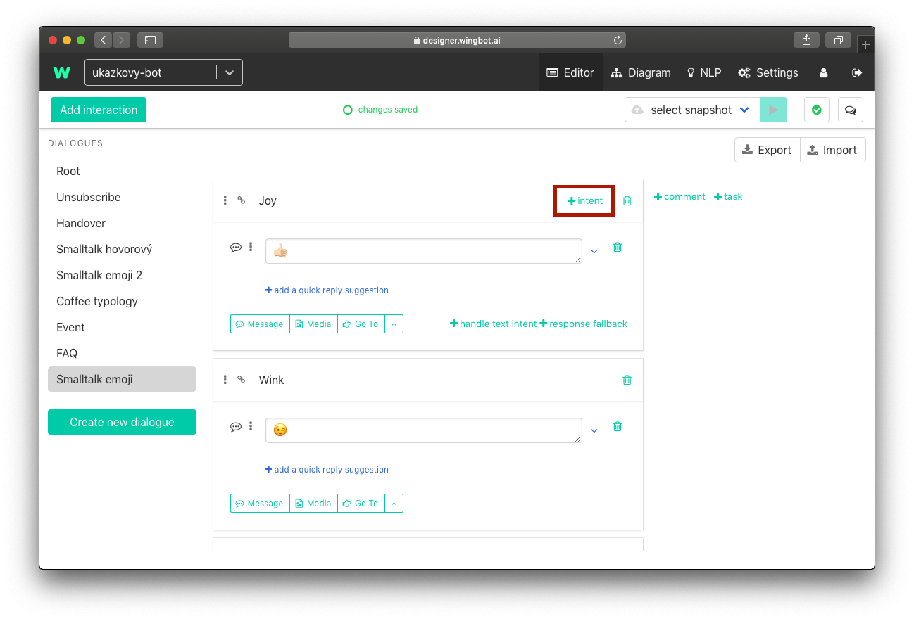
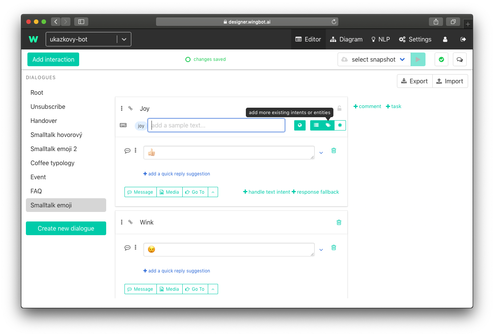
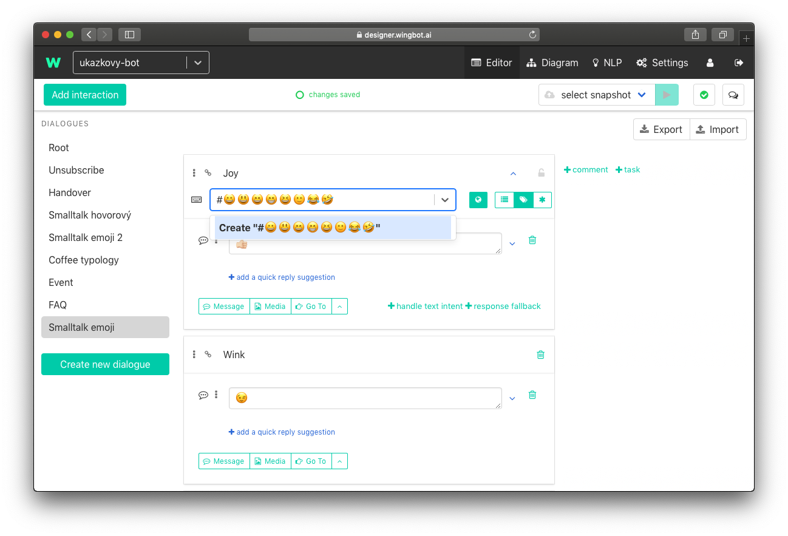

# How to answer FAQ and react to basic phrases

Important part of a chatbot is reaction to a user input even it's not in a dialogue. Common examples are: FAQ, reactions to emojis, greeting.

We will use intents again to solve these inputs. We used intents once, when we handed reaction of user in interaction. This is little bit different. Intent has not to be in reaction to your interaction. They want to know answer in different part of chatbot. So we let them jump to another part of dialogue for answer/reaction.

Diagram should help you to understand better:

- "WhereIsTheEvent" and "Navigation" are intents, which can be triggered from any part of the bot.
- "positive" and "negative" are intents which are trigered immediately in reaction to this interaction. 
- Why is intent "positive" used like this? The reason is that you don't want to have interaction Navigation as universal reaction to "positive" intents. The reaction for this content always depends on context. 

## Answers to frequently asked questions and common cases

... so people don't has to be robots. This part of conversation can solve a lot of conversations, which would be usually asked to customer care (or anyone who react, when user ask for it). It hasn't be a question. User is just searching for the right way. 

Examples:
- Contest bot - Did I won?, Show me competition rules., How to compete?, ...
- Event bot - When?, Where?, program, Is there any refreshment?, How to get there?, ...

Each question can be solved in 2 ways:
- The answer is in conversation - you can just add intent to the interaction
- The answer need new interaction

### The answer/reaction is in conversation

1. **Find the interaction**

  Find the right dialogue and the interaction.

2. **Add intent tag**

  - at the right top corner of interaction is "+ intent". If you don't see it try to click on interaction.

  

3. **Add intents**

  - type intents which can user type to get there

  

### The answer/reaction is new interaction

Our recommendation is to create new dialogue "FAQ" for there cases. So you can easily find them in future.

1. **Create new interaction**

  - add the new interaction ([guide](buildingABot/createDialogue/create_dialogue.md#create-basic-dialogue-with-interaction)). Interaction doesn't have to have quick replies and intent handlers.

2. **Add intent tag**

  - at the right top corner of interaction is "+ intent". If you don't see it try to click on interaction.

3. **Add intents**

  - type intents which can user type to get there

##Smalltalk with chatbot

We can use intents for reaction to basic conversation. This makes your chatbot more personal and "smarter". Users often test your chatbot or they just want to talk with him as a game. And trolls will often talk to your chatbot to.

We use more dialogues to separate smalltalk types:

- Emoji smalltalk - usually we use emoji for reply too
- Text smalltalk - for example greeting, "How do you do?", "How old are you?", "Are you human?", troll's questions...

###Emoji smalltalk

Emojis are frequently used by messaging users in normal conversation so your chatbot should be prepared for them to. 

1. **Create the emoji dialogue**

  - Create new dialogue "Smalltalk Emoji". If you don't know how, use [the guide](buildingABot/createDialogue/create_dialogue.md#create-basic-dialogue-with-interaction).

1. **Add interactions**

  - Prepare response interactions. 

  For example:
  

2. **Start adding intent**

  - at the right top corner of interaction is "+ intent". If you can not see it try to click on interaction.

  

2. **Switch to Tags**

  - at the right of input is switch. Use it to switch

  

2. **Create tag**

  Tags are names of intent group. But in the emoji case are intents to. The emojis in tag name are the intents. 

  - Type **#** and emojis. Each of these emojis will be intent. Example: #😀😃😄😁😆🙂😂🤣
  - And create it. 

  

  > **Adding emoji on Windows:** Position the cursor in any text field you'd like to insert an emoji. se the keyboard shortcut Windows key + ":.>" button.

  > **Adding emoji on Mac:** Position the cursor in any text field you'd like to insert an emoji. Use the keyboard shortcut Command - Control - Spacebar.

  > **Adding emoji on Mac with touch bar:** Position the cursor in any text field you'd like to insert an emoji. You can use touch bar to add smiles

###Text Smalltalk

The goal is to respond user as many times as possible. The easiest way is to choose the most used phrases and react to them.

Most used phrases, you should think about

  - **Greetings and farewells**: "Hi", "Hello", "Bye", ...
  - **Informations about chatbot**: "Who are you?", "How old are you?", "How do you do?", "Who created you?", "Do you eat?", ...
  - **Contact customer care**: "Can I talk to a human?", "call me", "help me", ...
  - **About user**: "I'm happy", "I'm bored.", "I like you.", "I miss you.", "I love you.", ...
  - **Vulgarity**: I'll not give you examples, but I think you can imagine them. In this specific case really thin about the best way to handle them and remember, tat users are REALLY creative.
  - **Courtesy**: "Great!", "Thank you", "No problem"
  - Another group of texts: **Check your chatbot on production to extend smalltalks.** 

How to handle them? Follow the [instructions above](../faq/smalltalk_faq.md#the-answerreaction-is-new-interaction)
