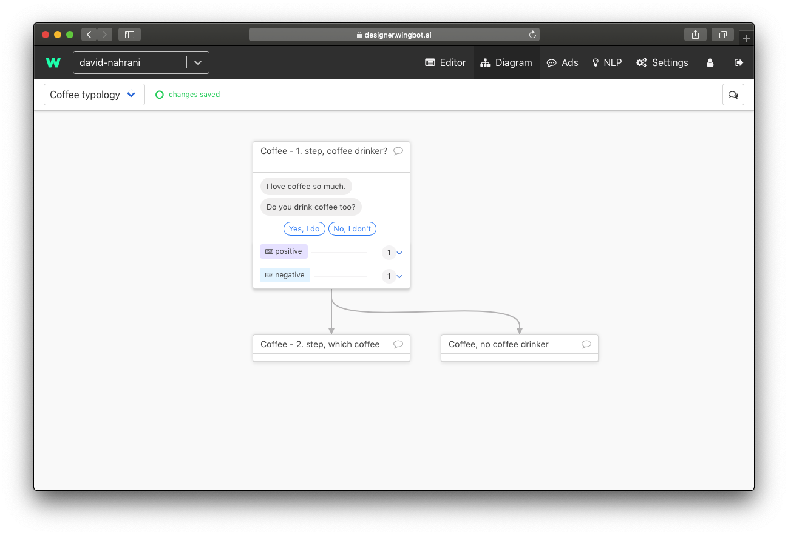
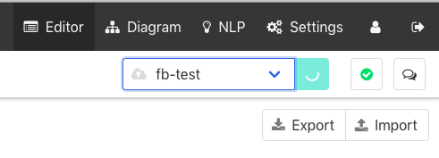
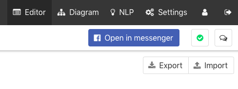
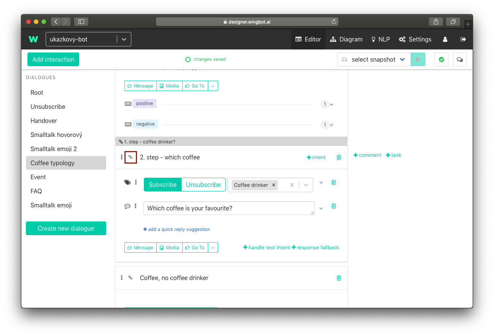
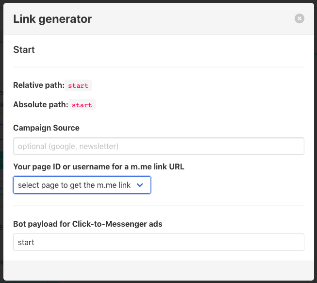

# Testing a chatbot

## Review your dialogues

  Check your dialogue tree in Diagram (link is in main menu at the top of page) :)

  Switch between dialogues is at the top left corner.

  

## Testing live chatbot

Another way is to talk to your chatbot. You need to deploy your chatbot to testing environment. I'll show you how to do this in facebook:

1. **Deploy to testing environment**

  - Select testing environment in the top right corner of the page.

    > Deploy can take even 10 minutes, if you made big changes (or you deploy chatbot for the first time).

  

2. **Start to chat**

  - Click to blue button. You can see him after deploy.
  - Try to chat with your chatbot.

  

2. **Fix mistakes**

  - Did you find a mistake? No problem, you can fix the problem in editor.
  - Follow step 1. to deploy your bot again.

##Testing the specific part of chatbot

You have deployed chatbot and you want to continue in testing from the last tested interaction. You can test your bot from any part of chatbot. You will need specific link for this...

1. **Open link generator**

  - Click to link icon at the left of the interaction name.

  

1. **Get m.me link URL**

  - Select page ID or username in the popup.

  

1. **Open link**

  - Link URL to your chatbot is at the bottom of the popup.
  - Use the URL in your browser to open chatbot with the interaction.

