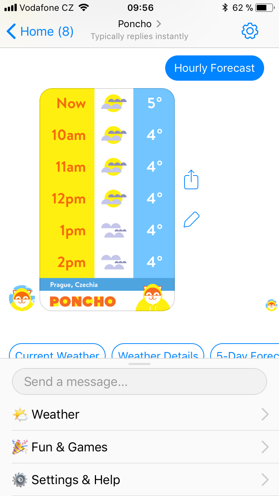

# Designing a character

Defining bot character has two important parts:

- **1. Personality definition - the character bible**

  Bot personality is a guide, how to write interactions - for everyone who gets involved.

  > When writing an interaction, always ask yourself: "what whould bot say"

  This guide can contain for example:

  + where your bot have studied, where "works"
  + where the bot lives, what is the bot's hobby
  + what kind he or she is
  + what are the tragic flaws of bot
  + is bot friendly and how easily can get upset

   

- **2. Bots visual style**

  Visual style is very important part of character. It includes:

  + profile and cover image
  + images and videos sent during conversation
  + visual style of bot's menu
  + visual style of bot's templates (Carousels, Lists, etc.)

    

  