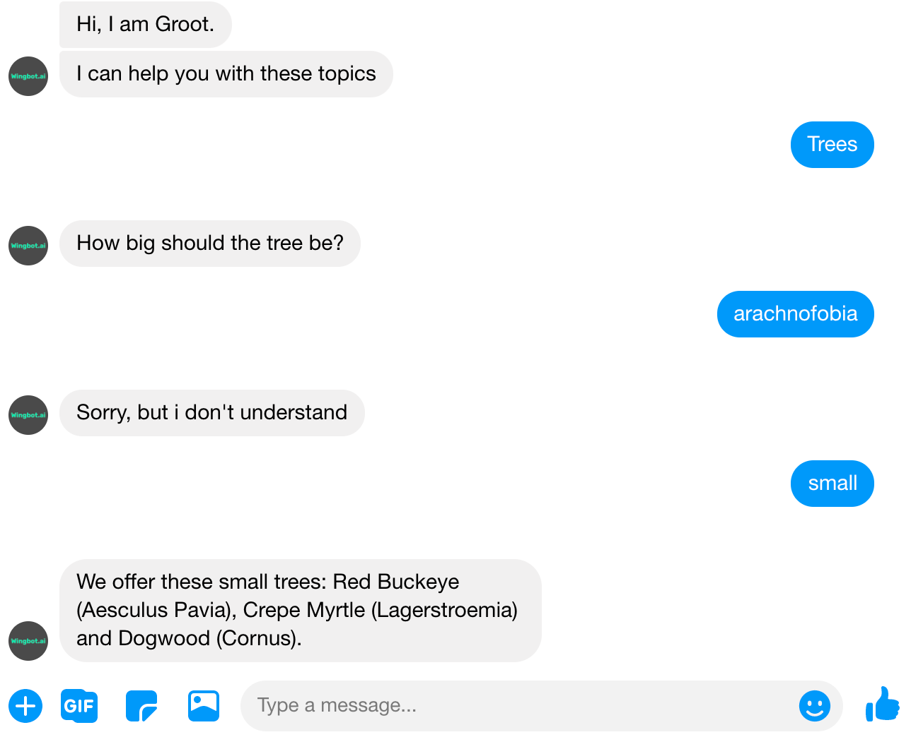
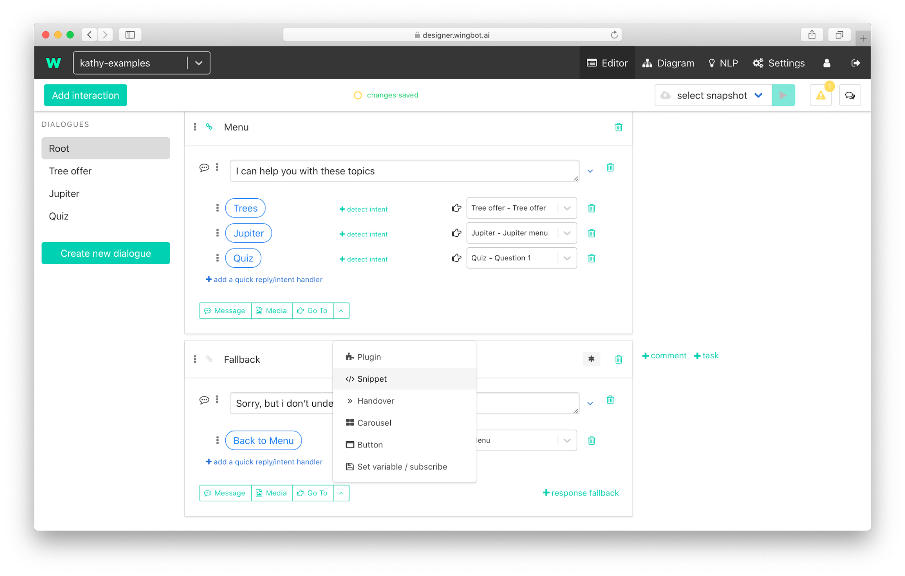
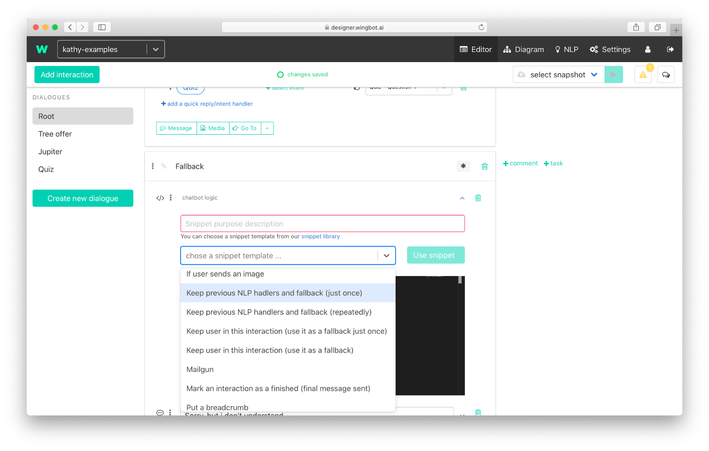

# Give user one more chance to correct answer

Sometimes, users give a bot the answer for questions, but bot's NLP do not understand and the response is made by fallback. The user wants to correct the answer, but it's too late. Bot do not understand again. Wingbot provides an easy solution, which will **give one more chance to the user**.
 

## Let the user make a mistake
We will prepare fallback for these situations by adding one snippet.

1. **Add a snippet** at the top of the fallback interaction (It can be dialog fallback or global fallback in root dialogue).

    

2. Select snippet **Keep previous NLP handlers and fallback (just once)** and click to Use snippet.

    

> You can find **more about context snippets** [here](./../HelpersForKeepingUserInContext/snippetsForContext.html).

> Take look **how contexts works** [here](./../keepUserInContext/keepUserInContext.html).