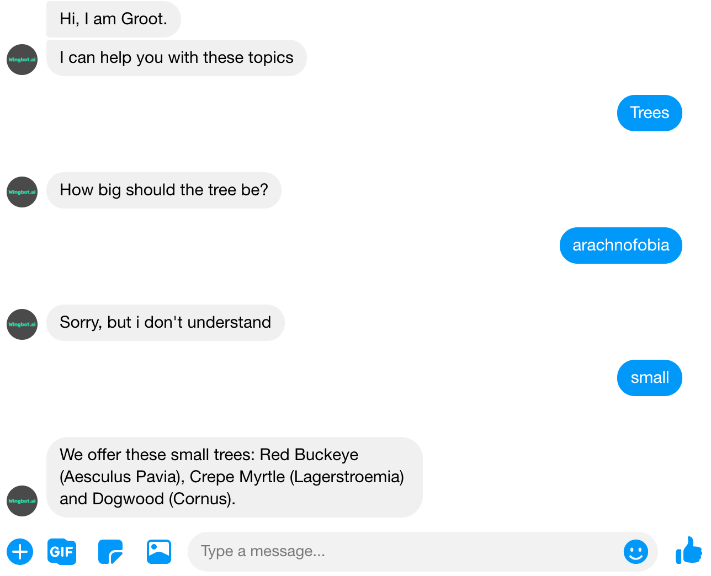

# Snippets for easy work with context

Wingbot provides you snippets which help you work with the context in fallbacks.

You may know the situation when you ask a question and users don't answer - even worse, users ask their own question instead. What should your bot do now? There are some possibilities how to do it in wingbot designer and depend on you, what suits better for our case:

1. **Loose context of interaction**
    - **Situation:** The answer to your question is not important. You let the user go to another interaction and respond him properly.
    - **What to use:** nothing. This set up is the default.
2. **Use the force: Get the answer for bot's question**
    - **Situation:** you really need the answer. Example: registration form.
    - **What to use:** Take a look at snippets [Keep user in this interaction (use it as a fallback)](#snippet-keep-user-in-this-interaction-use-it-as-a-fallback) and [Keep previous NLP handlers and fallback (repeatedly)](#snippet-keep-previous-nlp-handlers-and-fallback-repeatedly).
3. **In the middle - between option 1. and 2.** 
    - **Situation:** Reaction to the user's question is more important if exists. Otherwise, keep the user in this interaction.
    - **What to use:** Take a look at snippet [Respond with an intent (bookmark)](#snippet-respond-with-an-intent-bookmark).
4. **Respond to the user and keep in mind previous context**
    - **Situation:** You let user change the topic, but let the user correct the answer for previous question. Example: user make mistake at the answer and bot don't underestand (respond with fallback) - user can correct the answer.
    - **What to use:**  Take a look at snippet [Keep previous NLP handlers and fallback (just once)](#snippet-keep-previous-nlp-handlers-and-fallback-just-once).

## Snippet: Keep user in this interaction (use it as a fallback)

**Most used example: Get answer from users**
- At the interaction fallback to keep users at the interaction. Bot can give help to users and keep them in interaction. 

**About the snippet:**
- Use this snippet for keeping fallback of this interaction (where the snippet is used). So the context stays in this interaction..
- This snippet does not keep NLP handles.
- The snippet is applied whenever the user gets to this point of conversation.
- Should be used in the fallback of the interaction to keep the interaction's context.

**Take a look how to use this snippet:** [here](./../AnswerTheQuestion/AnswerTheQuestion.html)

## Snippet: Keep previous NLP handlers and fallback (repeatedly)

**Most used example: Get answer from users with the same options of answers**
- At the interaction fallback to keep users at the interaction. Bot can give help to users and keep them in interaction. 
- This snippet keeps previous NLP handlers.
> This snippet is very similar to previous snippet Keep user in this interaction (use it as a fallback)]. The difference is you don't need to set NLP handlers.

**About the snippet:**
- Keeps previous NLP handlers and fallback.
- Where to use:
    - At the dialogue or global fallbacks - keep NLP handlers and fallback from previous interactions.
    - At the interaction fallback - keep NLP handlers and fallback from this interaction (they are used again)
- The snippet is applied whenever the user gets to this point of conversation.

**Take a look how to use this snippet:** [here](./../AnswerTheQuestion/AnswerTheQuestion.html)

## Snippet: Keep previous NLP handlers and fallback (just once)

**Most used example: Give user chance to correct answer in fallback**
- At the dialogue or global fallback to keep the context of previous interaction just once. So the users can correct their reaction to chatbot's utterance.

**About the snippet:**
- The snippet keeps previous NLP handlers and fallback.
- Where to use:
    - At the dialogue or global fallbacks - keep NLP handlers and fallback from a previous interaction.
    - At the interaction fallback - keep NLP handlers and fallback from this interaction (they are used again).
- This is done just once.

**Take a look how to use this snippet:** [here](./../ChanceToCorrectAnswer/ChanceToCorrectAnswer.html)

## Snippet: Respond with an intent (bookmark)

**Most used example: offtopic with keeping context**
- Bot reacts to oftopic question (is the bot knows the answer) and return user back to context of interaction.

**About the snippet:**
- This snippet allows the reaction to intent in these situations:
    - If the intent's interaction is finished (goes to another interaction, shows “ending” format such as quick replies) the context stays in these interactions.
    - If the intents's interaction is not finished the context returns to the point where the snippet was used.

**How to use it:**
1. Prepare interaction with fallback (for example like we did there).
2. Add this snippet to the beginning of interaction fallback.

> Take look **how contexts works** [here](./../keepUserInContext/keepUserInContext.html).