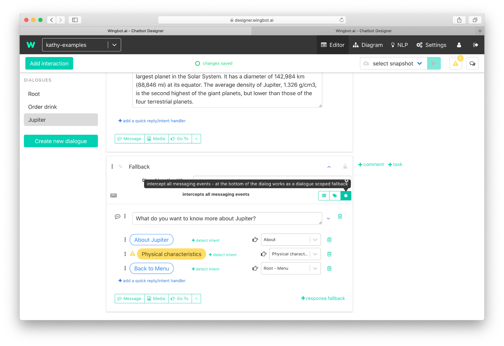

# Keep the user in the context

The designer provides 3 layers of context:
- [**Interaction**](#context-of-interaction) - a group of actions which are made during the reaction of the bot.
- [**Dialogue**](#context-of-dialogue) - a group of interactions. Something like a folder for files
- [**Global**](#global-context) - the whole bot

A really important part of the context is **fallback** - the interaction, which solves situations:
- When NLU does not understand.
- Was not found another suitable interaction for a reaction of the bot.

## Global context

This context includes whole bot's interactions.
- More about global fallback is in the chapter of [service interactions](./../../buildingABot/serviceInteractions/service_interactions.html).
- How to work with interactions with NLP on input is described [here](./../../buildingABot/faq/smalltalk_faq.md#answers-to-frequently-asked-questions-and-common-cases.html).

## Context of dialogue

This kind of context can be really helpful in situations when you need to **keep the user on topic**. And you use one dialogue for this topic.

### Interactions just for the context of dialogue

Our dialogue includes interactions and they can have NLP conditions on input. Sometimes the phrase used in NLP condition is too general and we know the meaning from the context. For this case, the designer provides opportunity set this NLP condition executable just in this dialogue. So the phrase will be used when the user is in any interaction of this dialogue. 

#### Example

- **Dialogue: about Jupiter**
- User last interaction: general interaction about Jupiter in dialogue about Jupiter
- User asks: **"How big is it?”** 
- Result: **Jupiter's width is 139,820 km**.
>Note: We know that the subject is “Jupiter” because we just talk about it. So we can answer without asking to subject.

### Set up interaction with NLP conditions just for the dialogue

You can switch condition to dialogue by **clicking on the globe** at the left of interaction's NLP detail - the result:

### Dialogue fallback
Dialogues can have their own fallbacks. This helps you with missunderestandings - **catch users before they leave the dialogue**. This is very useful when the dialogue covers one topic.

#### Set up dialogue fallback
You can add fallback on the input of interaction by clicking on * in intent set up of interaction.

>!!! Make sure, the interaction is last at the dialogue. 

## Context of interaction

You can do “magic” even in the context of interaction. It's possible to force users to answer the question ( take a look at the snippet [Keep user in this interaction (use it as a fallback)](./../HelpersForKeepingUserInContext/snippetsForContext.html#snippet-keep-user-in-this-interaction-use-it-as-a-fallback)). Or you can use the context of interaction very similarly as we used before in the context of dialogue. 

#### Example

- User last interaction: general interaction about Jupiter in dialogue about Jupiter
- User asks: **"How big is it?”** 
- Result: **Jupiter's width is 139,820 km**.
>Note: We can answer, because we know we just talk about Jupiter.

>The difference between this example and the example in dialogue context:
>- **Interaction context**: you need to set the NLP handler in each interaction in dialogue.
>- **Dialogue context**: you set NLP input in one interaction with the answer at dialogue. **You don't have to set NLP handlers in each interaction.**

### From the interaction to the global fallback
There is the following **order in dispatching** a conversation event through all contexts:

1. **NLP handlers on interaction** - how to set them are described in this chapter
2. **Interaction fallback** - helps you hold the user before he leaves the interaction. For example, you can “force” the users to answer the question - instructions here.
3. **Intents in the current dialogue**
4. **Intents in other dialogues**
5. **Fallback in the current dialogue**
6. **Global fallback** - in the Root dialogue

The first matching rule is executed.

> Take a look how **context snippets can help you** [here](./../HelpersForKeepingUserInContext/snippetsForContext.html).