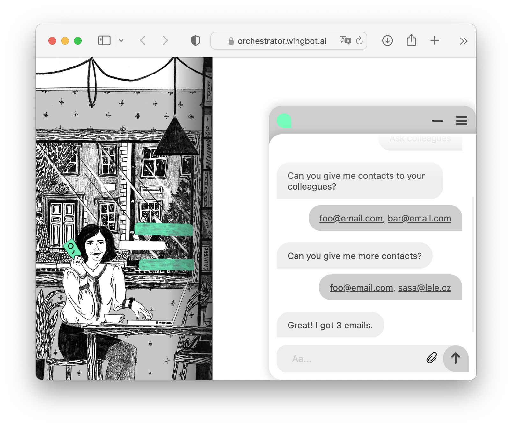
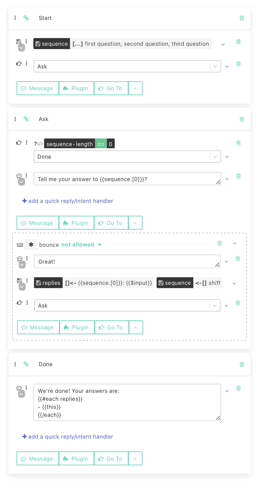
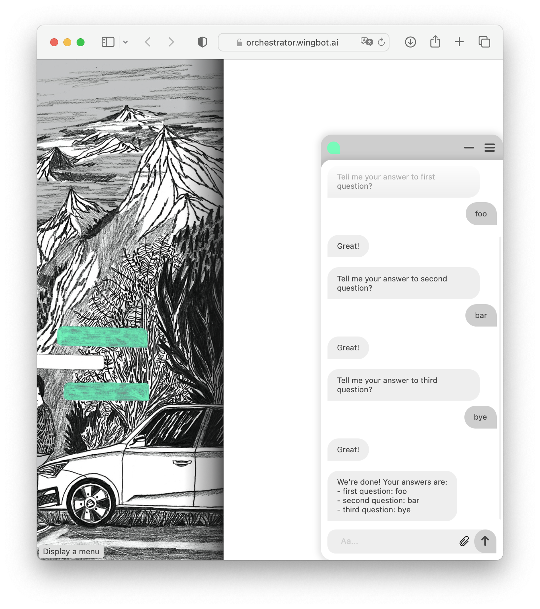

# Array variables

Wingbot.ai also supports array as variables.

## Operations: what to do with an array

### Create an array `[...] set`

- `[...] set | Foo` set a single value to array 👇
  ```
  "varName": ["Foo"]
  ```
- `[...] set | ` set an empty value to array 👇
  ```
  "varName": []
  ```

> When there is already some data in variable, it will be overwritten

### Add a unique item to array `[]+ add`

- `[]+ add | Bar` - value doesn't exists, so it'll be added
    ```
    "varName": ["Foo"]
         ⇩
    "varName": ["Foo", "Bar"]
    ```

- `[]+ add | Foo` - value exists, so the array will remain unchanged
    ```
    "varName": ["Foo"]
         ⇩
    "varName": ["Foo"]
    ```
### Remove an item from array `[]- remove`

- `[]- remove | Bar` - value doesn't exists, so it'll be added
    ```
    "varName": ["Foo", "Bar", "Baz", "Bar"]
         ⇩
    "varName": ["Foo", "Baz"]
    ```

- `[]- remove | Bar` - value doesn't exists, so the array will remain unchanged
    ```
    "varName": ["Foo"]
         ⇩
    "varName": ["Foo"]
    ```

  ```
### Push item to array `[]<- push` (to the right)

- `[]<- push | Bar` - just adds an item, no matter it exists or not
    ```
    "varName": ["Foo", "Bar"]
         ⇩
    "varName": ["Foo", "Bar", "Bar"]
    ```

### Pop item from an array `[]-> pop` (from the right)

- `[]-> pop` - just removes the most right item
    ```
    "varName": ["Foo", "Bar"]
         ⇩
    "varName": ["Foo"]
    ```

### Shift item from an array `<-[] shift` (from the left)

- `<-[] shift` - just removes the most left item
    ```
    "varName": ["Foo", "Bar"]
         ⇩
    "varName": ["Bar"]
    ```

## Values, which can be put into an array

- **plain text** (strings) - `[...] set | Foo`
  ```
  "varName": ["Foo"]
  ```

- **lists** - `[...] set | Foo, Bar\, Baz`
  ```
  "varName": ["Foo", "Bar, Baz"]
  ```

- **variables** - `[...] set | {{someVar}}`
  ```
  "someVar": "Foo"
  "varName": ["Foo"]
  ```

- **input text** - `[...] set | {{$input}}`

  **users message:** `hello!`
  ```
  "varName": ["Hello"]
  ```

- **text of quick reply** - `[...] set | {{$this}}` - works only inside a quick reply

  **quick reply:** `(Show me more!)`
  ```
  "varName": ["Show me more!"]
  ```

- **other arrays** - `[...] set | {{someVar}}`
  ```
  "someVar": ["Foo", "Bar"]
  "varName": ["Foo", "Bar"]
  ```

- **entities** - `[...] set | {{@email}}` - *when there are more occurrences of the entity, all values will be inserted*

  **users message:** `send it to foo@mail.com and to bar@mail.com`
  ```
  "varName": ["foo@mail.com", "bar@mail.com"]
  ```

## Using arrays in chat messages

Let's have an array like this

```
"varName": ["Foo", "Bar", "Baz"]
```

- **list items**

  *message input*

  ```
  {{#each varName}}{{this}}{{#unless @last}}, {{/unless}}{{/each}}
  ```

  *output*

  ```
  Foo, Bar, Baz
  ```

- **check if an array is empty**

  *message input*

  ```
  {{#if varName}}with items{{else}}empty{{/if}}
  ```

  *output*

  ```
  with items
  ```

- **simply show array items**

  *message input*

  ```
  {{varName}}
  ```

  *output*

  ```
  Foo,Bar,Baz
  ```

- **access the first item**

  *message input*

  ```
  {{varName.[0]}}
  ```

  *output*

  ```
  Foo
  ```
- **how much items are in the array**

  *message input*

  ```
  {{varName.length}}
  ```

  *output*

  ```
  3
  ```

## Example - ask for list of emails




## Example - messages sequence



