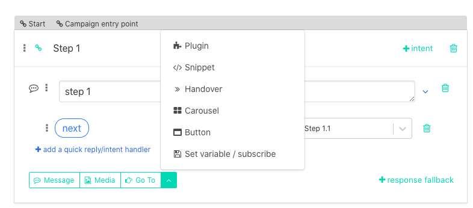
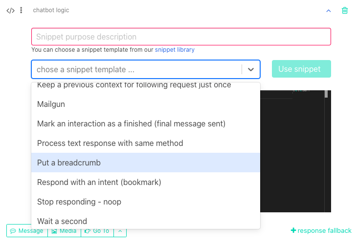
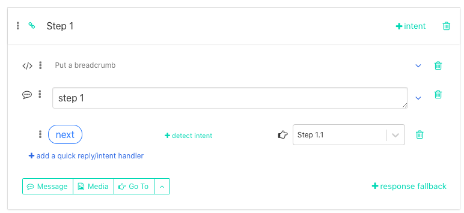
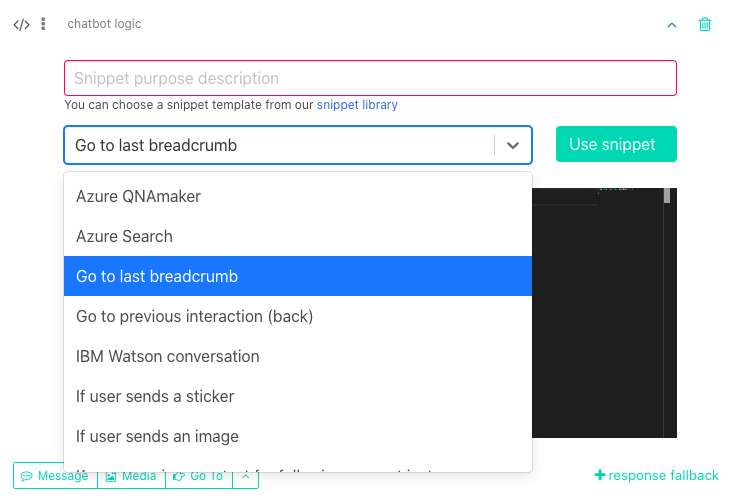
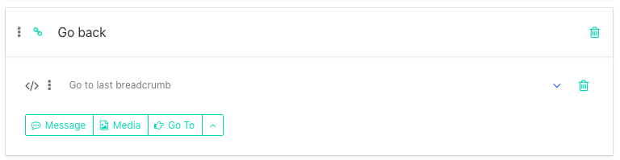
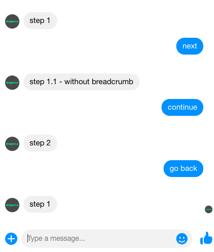

# Putting a breadcrumb

**What is it for?**

Breadcrumb is a snippet that allows you to send user back to a certain point in conversation that he must not start the chatbot flow from the beginning.

This is suitable technique for example in the situation when user is in the middle of the conversation, forgets about the chatbot and you remind yourself with a notification. If you use breadcrumbs snippet, user could start again on the very same point where he left off the conversation. Haha

**How to insert a breadcrumb**

Putting a breadcrumb is fairly easy:

1. In the specific interaction, choose from the drop-up menu "Snippet"

2. From the drop-down menu choose "Put a breadcrumb"

3. Push the button "Use"

4. Now your breadcrumb is ready to use. Last thing you need to do is to drag the snippet and move it to the very top of the interaction

Insert breadcrumbs to all interactions that could be useful.

**Going to the last breadcrumb**

We continue with creating an interaction that will send user to the last breadcrumb. That means on the last interaction user visited.

Process is similar to the one with inserting breadcrumbs. You only choose "Go to last breadcrumb".

With this snippet, interaction will look like this:

Now let's see what breadcrumbs do.

Look at this conversation:

Step one has a breadcrumb, but Step 1.1 hasn't. If we proceed in the conversation further to Step 2 and push button Back (which is sending user to the last breadcrumb), this button send us back to the last breadcrumb, which is in Step 1.