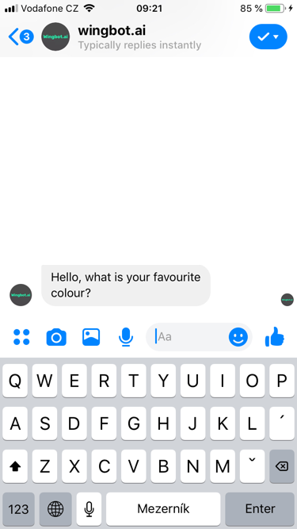
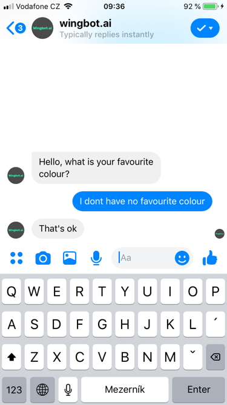
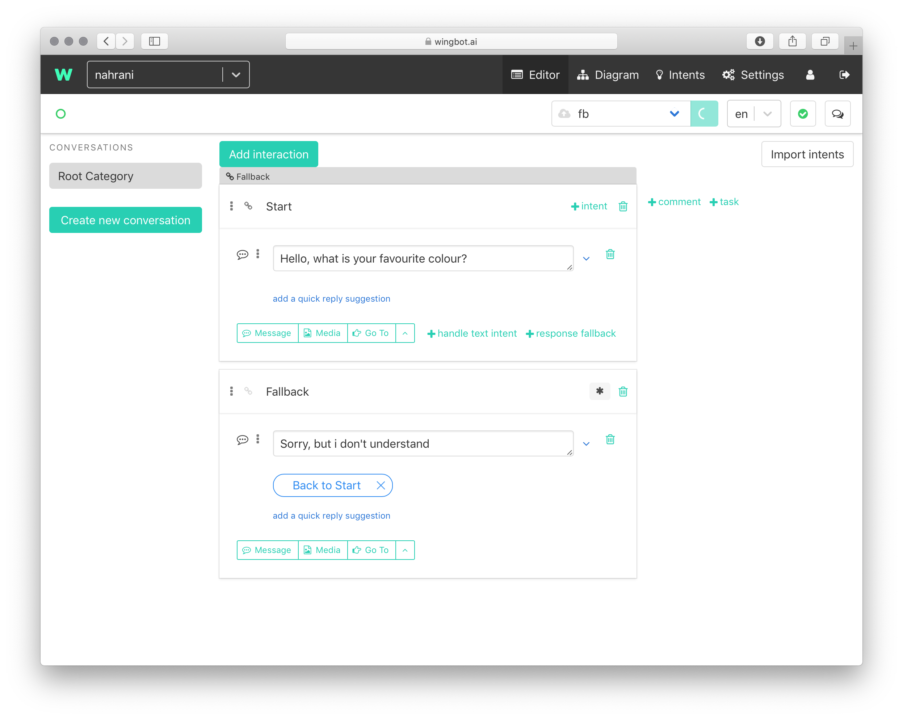
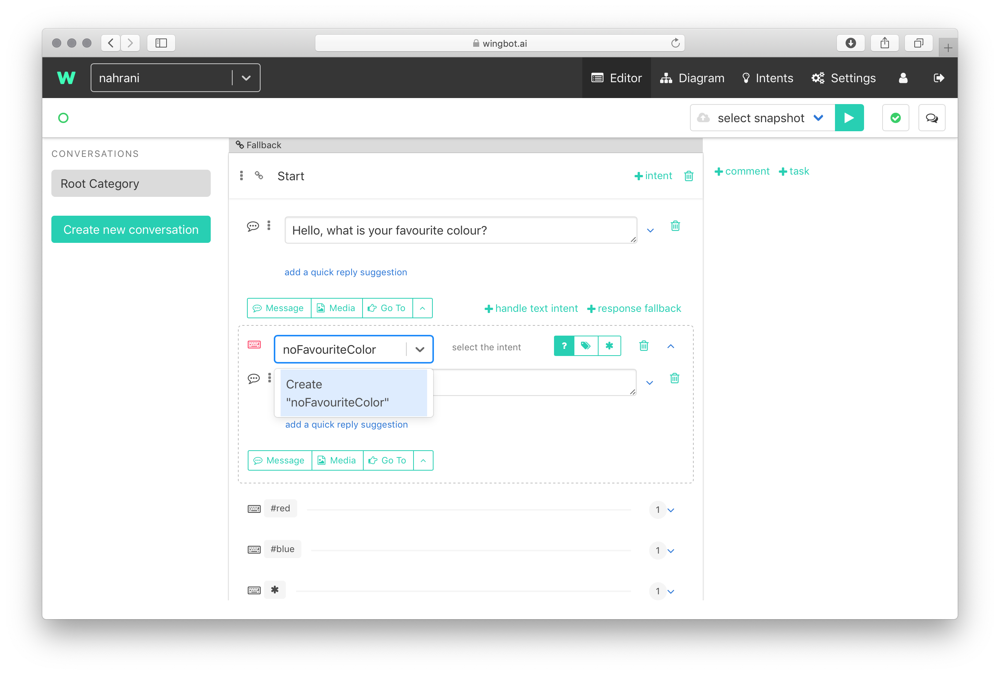
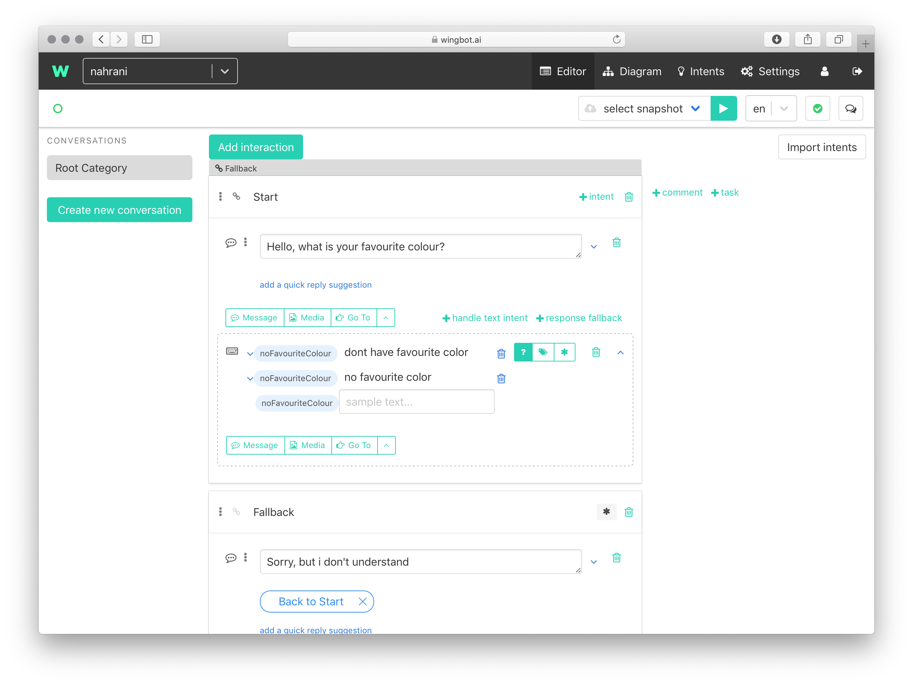
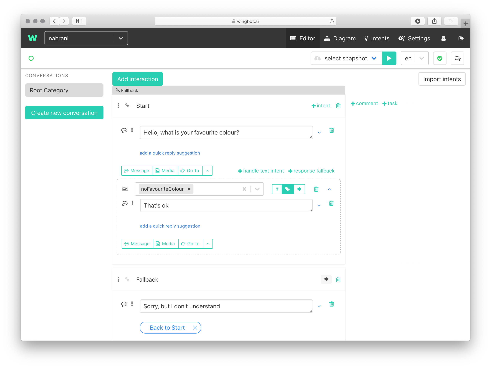
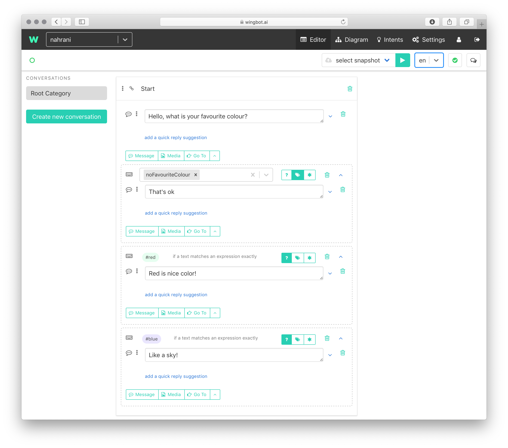
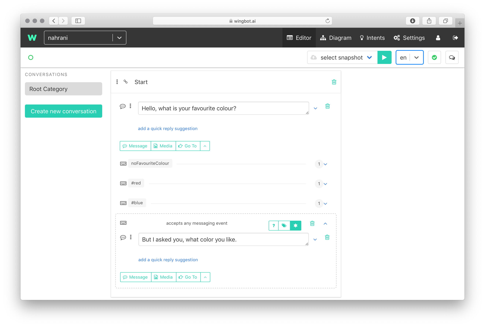
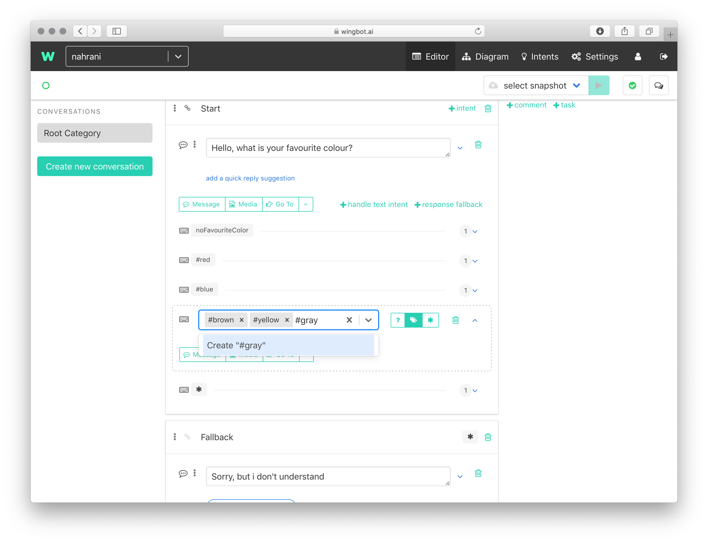

# Asking open questions

Open questions makes a conversation more natural and pleasant. There are few tips, how to make it right:

- keep the number of possible responses low
- mind, that **intens should have unique message samples** - it means
  you'll have to reuse your intents (like "positive" response)

How the open question look like?

So the user can answer simply:

How to achieve this pattern?

1. **Start with a question without quick replies**

  - make an open question, which forces user to respond very simply

  

2. **Add an intent handler with "handle text intent" and specify an intent**

  - each intent should have a self descriptive name - first specify the name

  

3. **Add some response samples as a training data**

  - each response sample should be unique among the all training data
  - when there's already an intent mathing your use case, **re-use it!**

  

4. **Create a bot's response**

  - the effect will be better, when the response confirms the bot uderstands

  

5. **Specify another responses**

  - you can use "phrases matching" instead of intents - just put a hashtag as a prefix of the intent: `#red`

  

6. **OPTIONAL: you can specify a default response - the response fallback**

  - when there's no matching response, this local fallback will be sent

  

7. **OPTIONAL: specify more than one intent**

  - when you'd like to detect more than one intent at once, you can add them!
  - toggle the switch from **?** to **tags** icon
  - insert all intent names you'd like to use
  - **you can specify the training data in the "Intents" section**

  