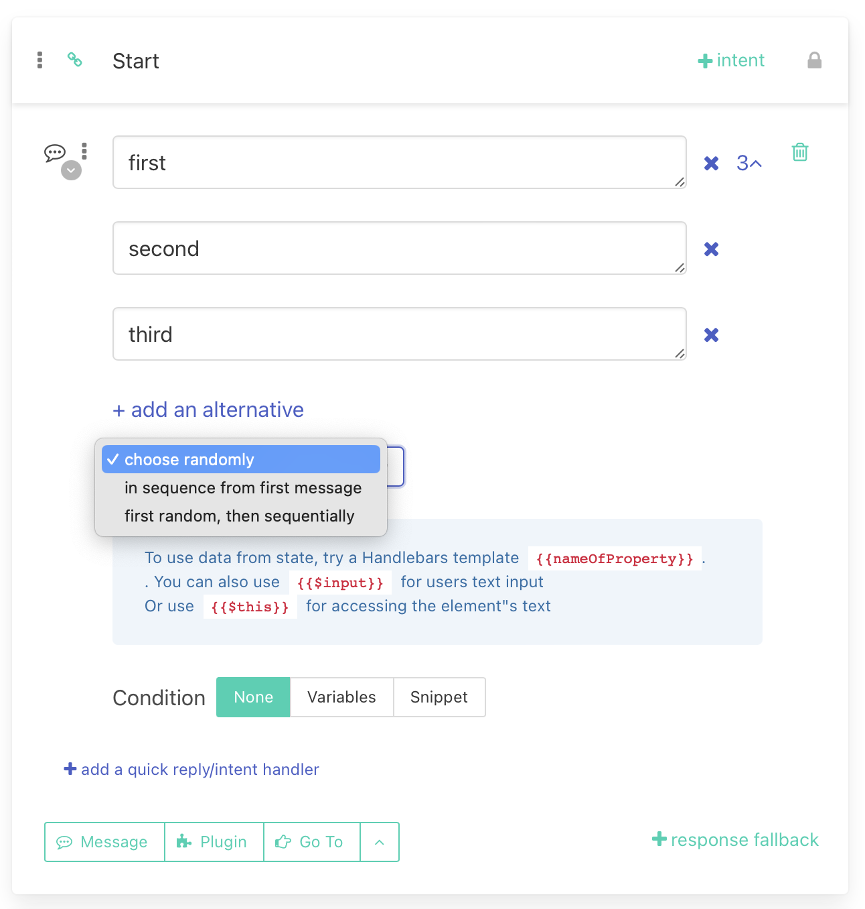
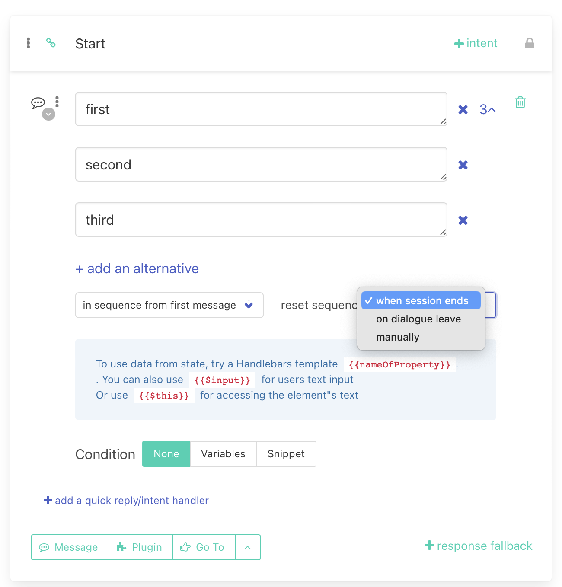

# How to use sequential messages

After you add more alternatives to the message, you can decide how the system will choose the alternative text that the bot will send to the user. 

In addition to the default random selection, the bot can send messages sequentially. That means whenever user visits specific interaction, bot will response with defined responses as they follow each other -  either starting from the first message ("in sequence from first"). 

Second option is to choose randomly where to start during the first visit and then following alternative responses in order ("first random, then sequentially"). Note that whenever bot submits the last alternative, it starts again from the first alternative.

## Resetting conversation state

If one of the sequential methods of sending messages (either "in sequence from first" or "first random, then sequentially") is selected, it is necessary to set how long the bot will remember the status of the sequence (at what position the last sent message was().

Here are the possible states:

- When session ends (default setting) - after 30 minutes of the user's last response or leaving the dialogue where the sequence message is located. Keep in mind that if after starting a new session the user continues the conversation in the same dialogue, the bot will keep the state of the sequence.

- When the user leaves the dialogue - if the user visits the interaction in another dialogue, the state of the sequence is forgotten and when the user returns, the bot starts sending messages again from the beginning

- Manually - the bot remembers the state of the sequence constantly

It is important to mention that if the number of messages in the sequence is changed during the user's conversation (by removing or adding an alternative), the bot can reset the state of the sequence to zero and start selecting alternatives from the beginning.