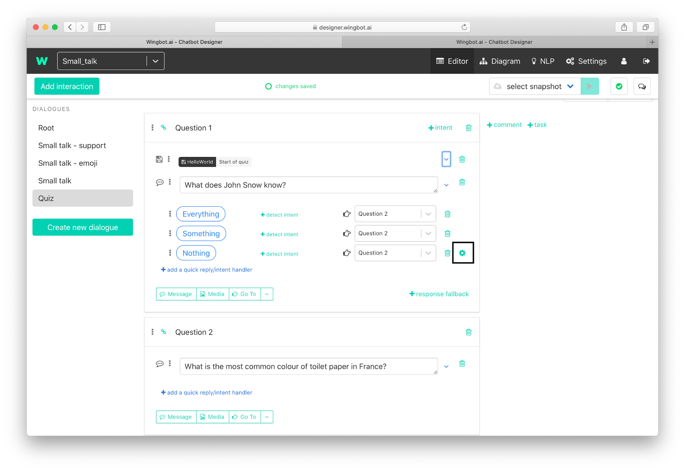
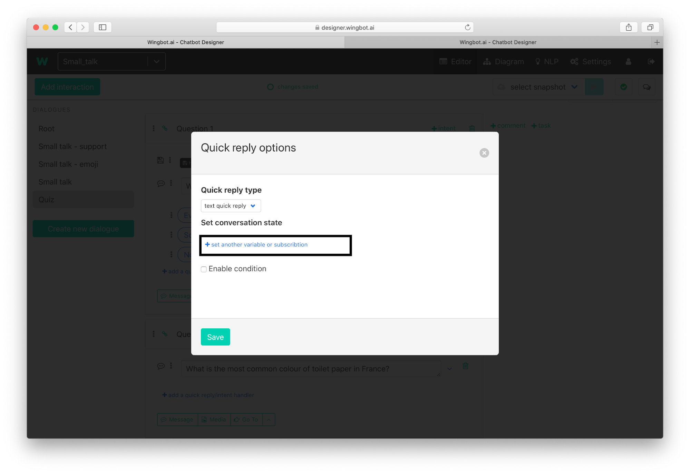
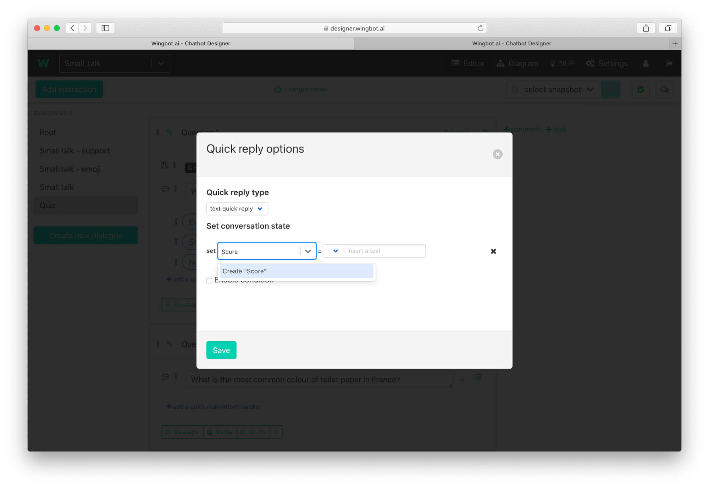
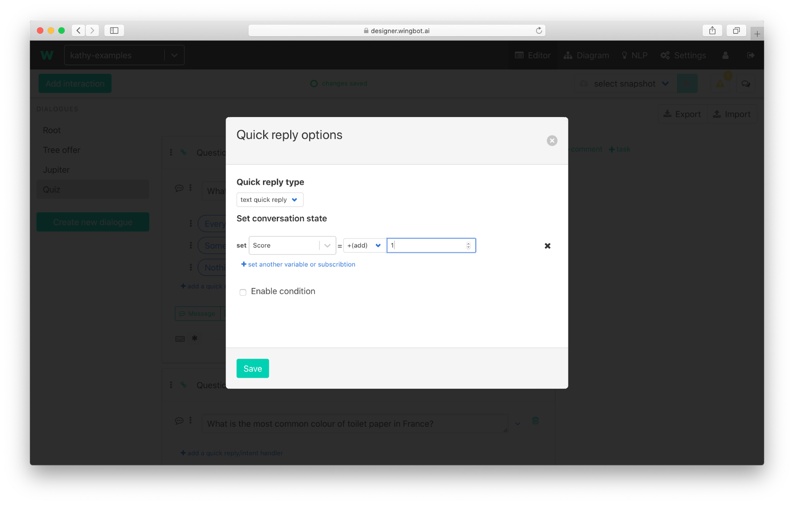

# How to set variables

Wingbot designer is user friendly for basic operation with variables. You don't have to be programator to do it.

Variables are really useful, when you want to remember something. The most frequent use cases:
- **Remember all the user's answers for questions**
- **Count user score** - based on quiz or simple questions during the conversation

There are 2 ways to set the variable in wingbot designer - set variable in integration and set variable in answer in interaction.

## Set a variable in interaction

1. Click on **Set variable/subscribe** in menu at the bottom of the interaction.

2. **Click on the drop down** at the right.

3. Write **name of your variable** and click on create. 

> Name of variable can't include special characters including white spaces.

4. Select **type of variable** and write the value

## Set a variable when user answers

1. Click on **Settings icon** (shows on hover) at preset answer

2. Click on “**set another variable or subscription**”

3. **Select existing variable or create new one**

4. **Set the value**. In this case increase the score by 1.

5. Click on Save.

## Type of variables and operations

You have predefined options on how to set variables in the designer.The options are the most frequently used ones and help you in majority of cases:
- **Text** - selects the type of variable and than you can - write a text value
- **Number** - selects the type of variable and than you can write a numeric value
- **True** - Sets the value to “true”.
- **False** - Sets the value to “false”.
- **Null** - Sets the value to “null”. This is useful for resetting the variable.
- **+(add)** - select this for increasing the value of numeric variables. When the variable does not exist yet, then it creates the variable and sets the value.
- **@entity** - this option is very useful when you need to remember value and it's also value of entity. This option will set and remember the entity - you don't have to ask for this user again.
- **Text input** - Creates text variable and sets up the value of user answer - text or other input (text of quick replies, buttons, …).