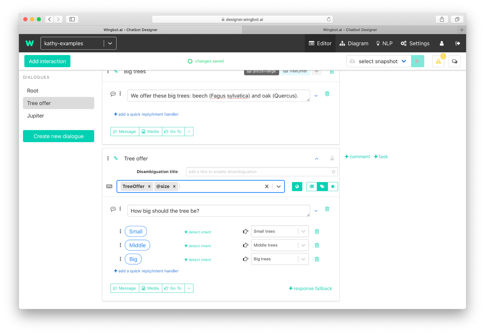

# Slot filling

This feature helps you easily get needed information from users. One way to get information is to ask the user little by little. The second way is that the user can type the information at once. All you need to do is have **information in the entity** and you can solve both situations easily.

## Basic slot filling (two entities)

**Example 1: Directly to interaction Big trees**

**Example 2: Ask for information about size**

## Slot filling with one parameter

1. **Create an entity** with information

    

2. **Create intent linked to the entity**

    

3. **Prepare interactions**: create interactions for small/middle/big tree offers

    

4. **Add intent to interactions**

    

5. **Add entity to interactions**

    

6. **Set value of entity** (depends on the size of trees in interaction)

    

7. **Create interaction** which do not get the size of a tree. small/middle/big tree offers

    

8. **Add intent and entity to interaction**

    

9. **Set value of entity to optional**

    

10. **Add also handlers for responses.**

    

### Diagram of result

----------------------------------

## Advanced slot filling

Let's start by defining the steps of the slot filling

**Slot filling - register**

The main plugin, which starts the whole process.

- it should be placed in a separate interaction **without intents or entities**
- all related interactions **have to be within the same dialogue with a register plugin**

The plugin requires following settings

- **intent name**, or a list of intents separated by comma (intent +label can't be used)
- **"finished"** interaction - the plugin passes user here, when all entities are collected
- **entities**
    - **entity name** - every entity can be used only once
    - **question interaction** - the interaction where user is asked to provide the entity
    - **question type**
        - *required* - redirects user to the "question interaction", when the entity wasn't provided when starting the process
            - entity value is stored within a state in a `@entity: any` key
        - *multi value* - accepts more than one entities
            - entity values is stored within a state in a `+entity: any[]` key **as array**
        - *additional* - the entity is accepted only when starting the process - user will not be asked to provide the entity later
    - **validation interaction (optional)** - the interaction will be visited right after fulfilling the entity (the process will be described below)

> list of entities is an ordered list - the entities will be acquired right in provided order

> all provided **entity variables will be emptied**, no matter they were previously filled

**Slot filling - continue**

This plugin has to be **in the same interaction as the register plugins is**.

The plugin should be called after acquiring an entity.

- **skip back (optional)** - list of entities to reset their values - when the entity value **is not additional**, user will be asked to provide its value

### Asking user to provide entity (question interaction)

The only requirement for a question interaction is, it **has to call "Slot filling - continue" plugin**

- the process of acquiring a value of the entity can have more steps (user can be asked in more than one interaction)
- the interaction is responsible for storing the entity value (to variable `@entity` or `+entity` in case of multi-value entities)
- there is no need to fill some value - **the interaction can keep the entity empty and call "continue" plugin**
- the interaction can fill any other entity - **user will not be later asked to provide the entity**

> the best way to store the entity value is using of **entity handlers** by quick replies

> It's easy to skip a required entity by using a goto action at the beginning of the "question interaction".

### Entity value validation (validation interaction)

How to validate the entity

- **entity was valid**: just stop replying (or don't send anything) - the slot filling will continue automatically
- **entity is invalid**: send a message with handlers (or quick replies) - when user fixes the value, just call "continue" plugin

How the slot loading decides, whether the entity was valid or not

- when no message is sent during the validation, the bot will continue to the next step
- when a message is sent without quick replies a it is not a last message of the interaction the bot will continue as well
- when the message is sent with quick replies or it is placed on a last place of the interaction

### Multi-value entities

The main difference when using multi-value entities is that the value is not stored under variable with full entity name (`@entity`) but
under variable with plus sign instead of @ (`+entity`).

It's not possible to just assign values to variable, but it's necessary to use array operators (`[...] set`, `[]+ add`, `[]<- push`).

### Getting back

You can use **Slot filling - continue** plugin and fill an "entities to reset" input with entity names to reset.
The slot filling will mark the entity as "not filled" and the bot will continue asking for a first required entity, which is not filled.
