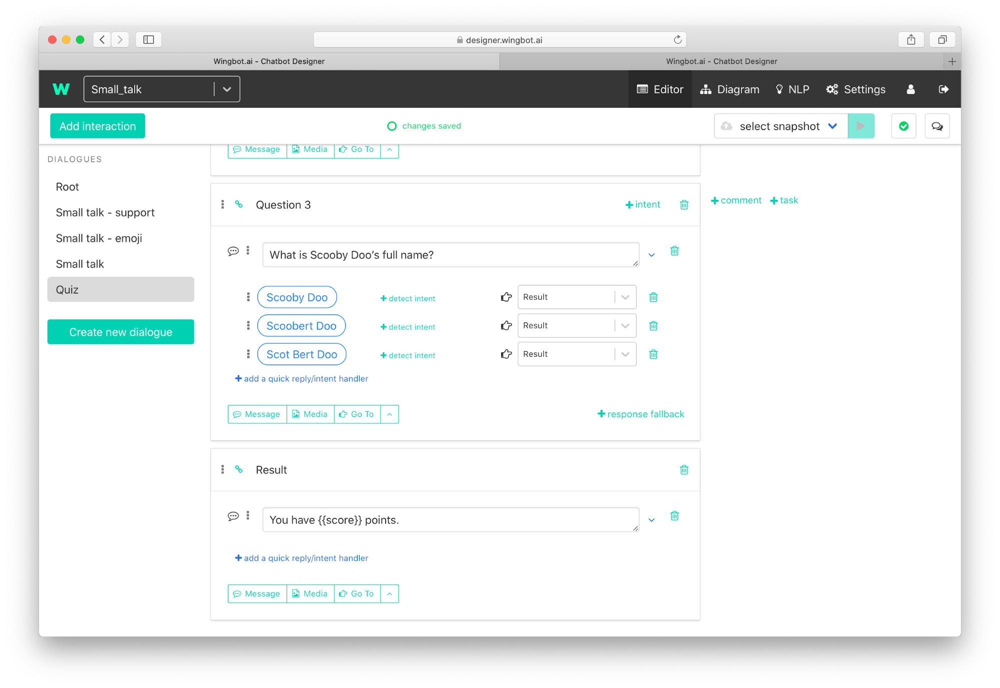

# Using variable in bot`s response

You can use variable value anywhere in chatbot texts by using `{{name of variable}}`. For example, when you want to tell the final score:

Examples: text in designer `You have {{score}} points.`

Example 1
- Variable value: score = 3
- Result is: **You have 3 points.**

Example 2
- Variable value: score was not set
- Result is: **You have points.**

## Simple conditions: Variable may not exists

You can use conditions in text to handle this case. The syntax is 
`{{#if name of variable}}` … `{{else}}` ... `{{/if}}`

Take a look at [documentation](https://handlebarsjs.com/guide/builtin-helpers.html#if) to use `{{if}}` properly. The opposite condition is `{{#unless}}` - specification is [there](https://handlebarsjs.com/guide/builtin-helpers.html#unless).

Now we can upgrade text for result of score:

Examples: text in designer `{{#if score}} You have {{score}} points.{{else}}You don't have a point yet. 😔{{/if}}`

Example 1
- Variable value: score = 3
- Result is: **You have 3 points.**

Example 2
- Variable value: score was not set
- Result is: **You don't have a point yet. 😔**

## Advanced: Iterating through array of values
Variable type arrays or specific objects can have more values than one. You may need to iterate them to get whore result. In this case `{{#each}}` syntax will help you. Documentation is [there](https://handlebarsjs.com/guide/builtin-helpers.html#each).

Examples: text in designer `Values are:{{#each myArray}}  {{myValue}} 🙂,{{/each}}`

- Variable value: myArray:[{myValue:1},{myValue:8}]
- Result is: **Values are: 1 🙂, 8 🙂,**

## All handlebars templating available

You can use Handlebars resources for more examples and informations how to use it’s templating features: [https://handlebarsjs.com/guide/](https://handlebarsjs.com/guide/). 
