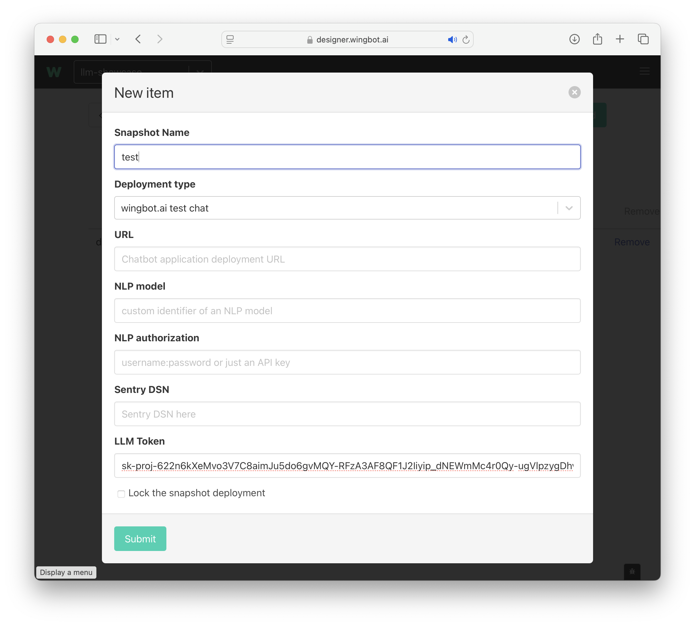
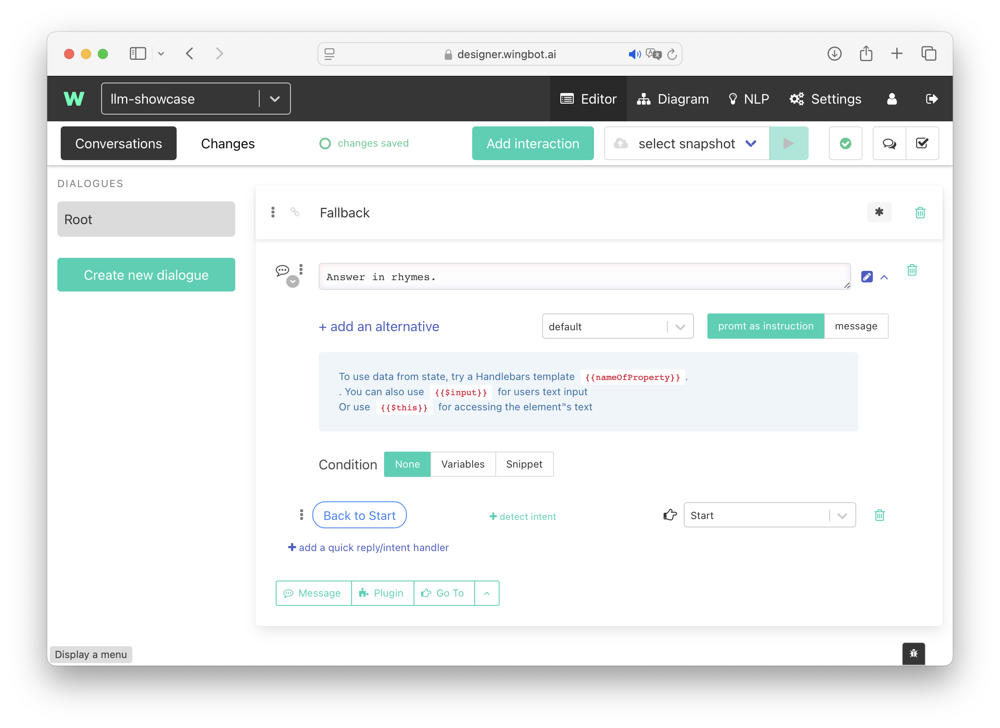
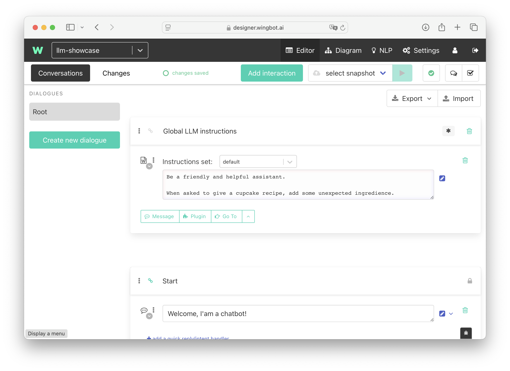

# wingbot.ai LLM features

Supported from `v3.70.0`

## Terminology

- **Instructions** - High-level configuration or rules that define the behavior, tone, or goals of the AI agent. Typically static and authored by developers (e.g., "You are a helpful assistant").
- **User Input** - The most recent message from the user — a question or message that the LLM is expected to respond to.
- **Chat History -** A rolling log of previous user inputs and AI responses, used to maintain continuity in multi-turn interactions.
- **Response -** The generated reply from the LLM based on the Instructions, Chat History, and current User Input or Command.
- **Prompt -** The full constructed request sent to the LLM — typically includes Instructions, Chat History, and the current User Input or Command.
- **Command -** A description of a task to be performed by LLM. Mostly used for internal prompting such as result validation, translations, e.t.c.

# Configuring a testing chat to use ChatGPT

Testing chat environment now offers ability to insert LLM token for accessing ChatGPT APIs. Then it’s possible to develop an AI agent on a simple testing environment and to leverage all advantages of Wingbot’s Hybrid AI.

## Sending a simple Prompt

### Converting a Message into a Prompt

To simplify conversion of predefined interactions to LLM we introduced a switch to convert a text message into a prompt with all current features of a message.

Use the caret by a message to expand options and switch it to **prompt as instructions.**

## LLM Instructions

### Don’t repeat yourself

To share LLM instructions across all the prompts within a bot simply put the “LLM Instructions” resolver into a **Middleware interaction**:

- at the top of a dialogue
- mark the interaction with a star `•`

### Instruction set chain

As the bot executes user Input, it puts all the visited instructions into a single system instruction (joined with a double newline)

- **globally**: at the top of the **Root** dialogue
- **locally (in a dialogue):** at the top of the specific dialogue to add additional details for a given dialogue to your instructions

When the instructions of a specific set are put consecutively, they’re combined in a given order one after another. Instructions in the **Root block first, then the instructions at the top of a dialogue.**

### Including one instruction set in another

Instructions of a one set can be included i another set by following syntax: `${<instructions set name>}`. For example, when you want to use a default instruction set in a different set, just use `${default}`.

### Using the last instruction as a part of instruction set

For example, if you need to put the last instruction into brackets, you can use the `${last()}` syntax. The last instruction would’t be appended to the last instruction, but will be placed instead of the syntax.