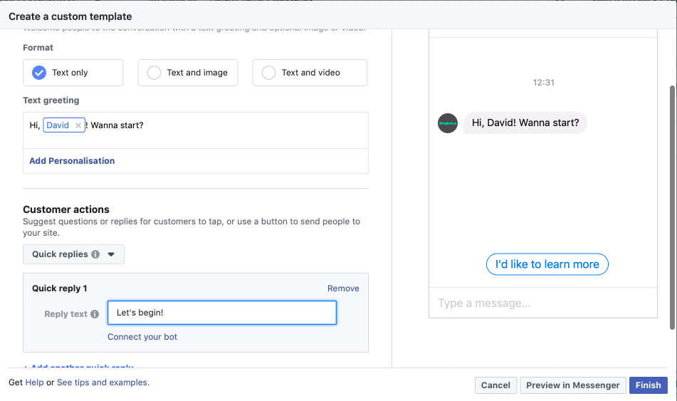
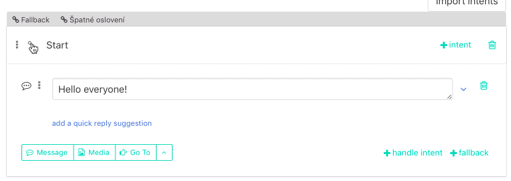

# Set Chatbot to Facebook Ad

This article is about how to connect existing wingbot chatbot to existing facebook ad. If you don't have chatbot yet check [how to create dialogue in wingbot](buildingABot/createDialogue/create_dialogue.md). If you don't have facebook check [Facebook insturictions](https://www.facebook.com/business/help/1361486070635113)

##Prepare first interaction at Facebook ad

This interaction will be shown to user as first message. User has to respond to it. The simplest way is to give him some quick replies. Don't close the window with this ad, we will use it later.

## Prepare connection at wingbot

1. **Click to link icon at the interaction, which you want to connect**

  + interaction should continue in conversation with user from first interaction tsent from facebook add.
  + the interaction below is illustrative

  

2. **Set campaign**

  - You could analyze audience from specific campaign, source and medium. 

  

2. **Copy the Bot payload for click-to-messenger ads**

3. **Connect chatbot to facebook interaction**

  - go back to facebook add to the interaction
  - paste the copied payload data to facebook add

  