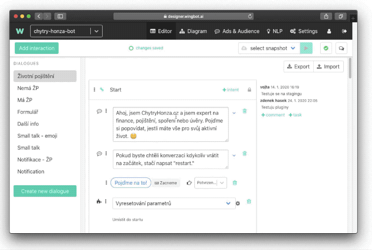

# Cross-validation

When you have in your chatbot enough samples in NLP there is one feature that will help you decide if your NLP ecosystem is healthy and prepared. Because some intents might collide. This feature is called cross-validation.

**The philosophy behind cross-validation**

The idea of cross-validation is that you take one-fifth of all utterances and cross-validate it against the remaining ⅘ of utterances. The idea is that the Designer will tell you which intents might be problematic or if there are obvious errors. It also shows how the system perceives some of the utterances. It can also serve as a guideline if some of the intents need to be strengthened or divided.

**How to cross-validated NLP**

Cross-validation is located in **NLP** > **NLP Validation**. Hit the button on the left side panel. Don’t be a surprise, cross-validation process could be long (10-20 minutes are quite normal).

After cross-validation is finished. The report will look like this:

In the first column, you can see an intent where it was expected for an utterance to fit. In the next column is an intent where this utterance falls. In the third column, you see with which confidence Designer see given utterance to fall. And in the last column, you can find the actual utterance.

**How to deal with the results**

As we mentioned at the beginning, results of cross-validation should only be a lead on which intents you should focus on. The aim is not to solve all the collisions but only focus on specific utterances or intents that might pose problems in the future.

> The **red zone**: potentially problematic intents. Try to focus on both expected intents and detected intents.

> The **yellow zone**: focus on intents with most occurrences and try to fix them.

> The **white zone**: just for your information.

The most common problems in training data:

- the clear conflict between those intents - consider merging them into the single intent
- too few utterances in intent - add them (every utterance should have a twin - very similar utterance with a minor variation)
- one intent has much more “stop words” than the other - reduce them or distribute them into other similar intents