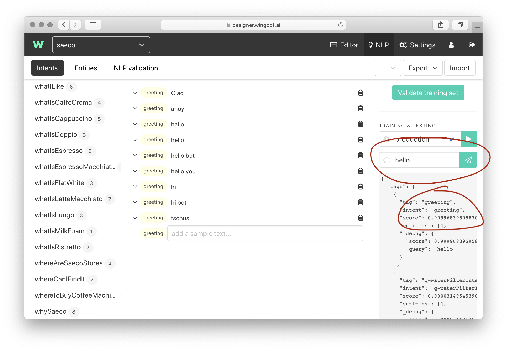
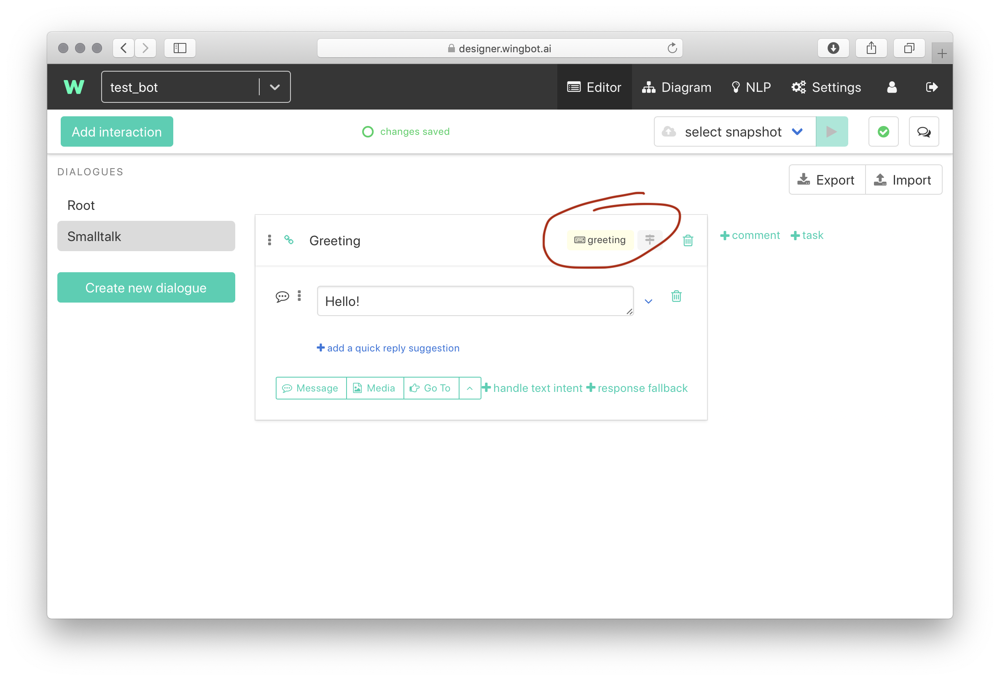

# Troubleshooting NLP

This is the best approach to reveal most common mistakes.

1. **Is the NLP well trained?**

    Use the **NLP trainer/tester** to ensure the right intent was found.

    

    If a score is too low, or a different intent was matched, refine utterances of the intent.

2. **Is there an interaction with appropriate intent condition?**

    Often there's a missing or incorrect intent/entity condition.

    

3. **There's a response fallback in previous interaction, which intercepts all user responses**

    Use **conversation history** to reveal a context, where your response was processed.

4. **The general condition should be below more complex conditions (2.xx)**

    With older versions of Wingbot it's important to keep more specific conditions above the less specific.

    
