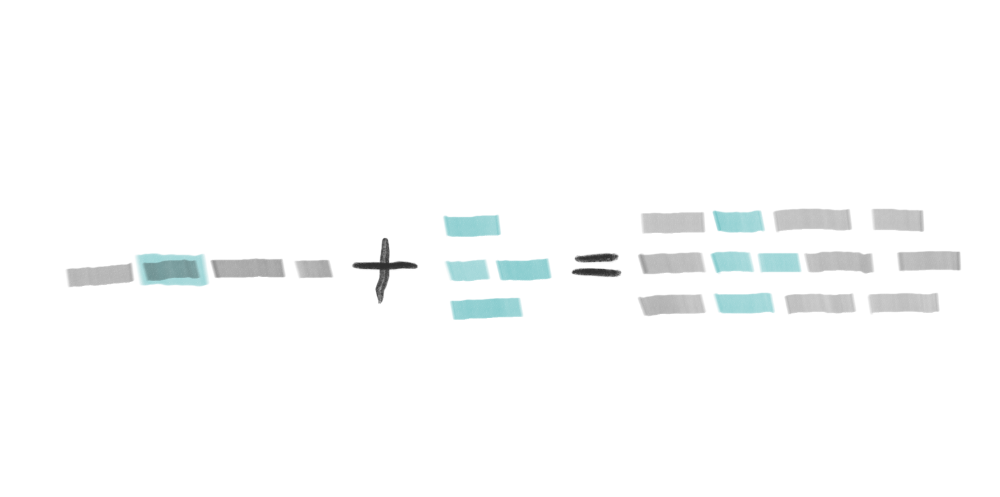
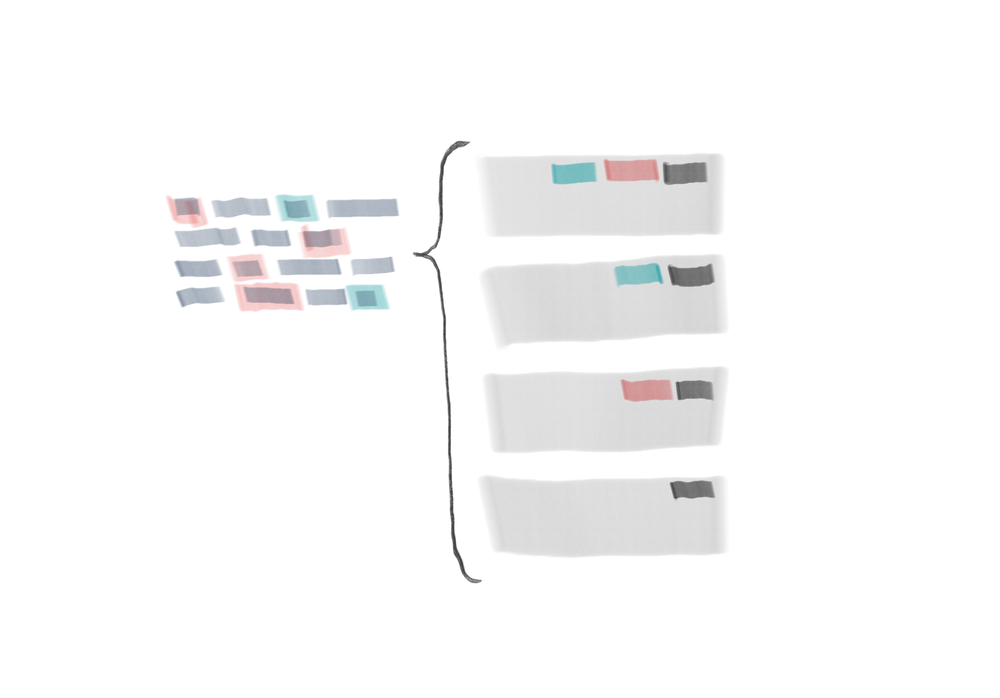

# Understanding the concepts

## How the intent condition is evaluated

- **any** of listed intents are matching
- **all** of listed entity conditions are matching

So the condition could look like this

```
( [entity-1] AND [entity-2] ) AND ( [intent-1] OR [intent-2] )
```

## The closest match wins

If there is **more then one matching conditions**, the closest one wins. Also **in 2.xx version bots** the sophisticated conditions should be above the less complex conditions.

Also if **the difference is too big** (lot of additional redundant entities), there'll be no match.

## How the matching score is calculated

Let's have a following intent and some entities matched:

```json
{
    "intent": "travel",
    "score": 0.9,
    "entites": [
        {
            "entity": "destination",
            "value": "Prague",
            "score": 1.0
        }
    ]
}
```

And let's have theese three interactions with following conditions

1. **entities: `@destination` and `@transportType`, intent: `travel`**

    This interaction is not matching, because there's **`@transportTypes`** entity missing.

2. **entities: optional `@transportType?`, intent: `travel`**

    This interaction is matching, but:

    - there'll be little penalisation (0.001) for missing optional entity **`@transportType`**
    - there'll be penalisation (0.05) for redundant recognized entity **`@destination`**

3. **entities: `@destination`, intent: `travel`**

    This interaction is fully matching and there'll be no penalisation.

4. **intent: `travel`**

    This interaction is matching, but:

    - there'll be penalisation (0.05) for redundant recognized entity **`@destination`**

5. **just entity: `@destination`**

    This interaction is matching, but:

    - there'll be penalisation (0.15) for redundant recognized intent **`travel`**

## An entity extends the utterance

An utterance should keep its meaning while replacing the marked entity with it’s values.



## The bot should be ready to answer all entity combinations

There should be an interaction for all possible combinations of entities used in intent utterances.



## Best practices for building the training data

**before creating new intent**

- use the **NLP tester** to ensure there is not already similar intent

**when adding utterance examples**

- always add **at least a pair of examples**

    example: `I need a break` and `I want a break`

- if a word could be omitted, add another example

    example when adding `I need a break` add also `I need break` and `need break`

- combine short examples with long examples (use your imagination)

    example: `need coffee` and `i need a coffee please`

- an intent should have **at least 10 utterances**