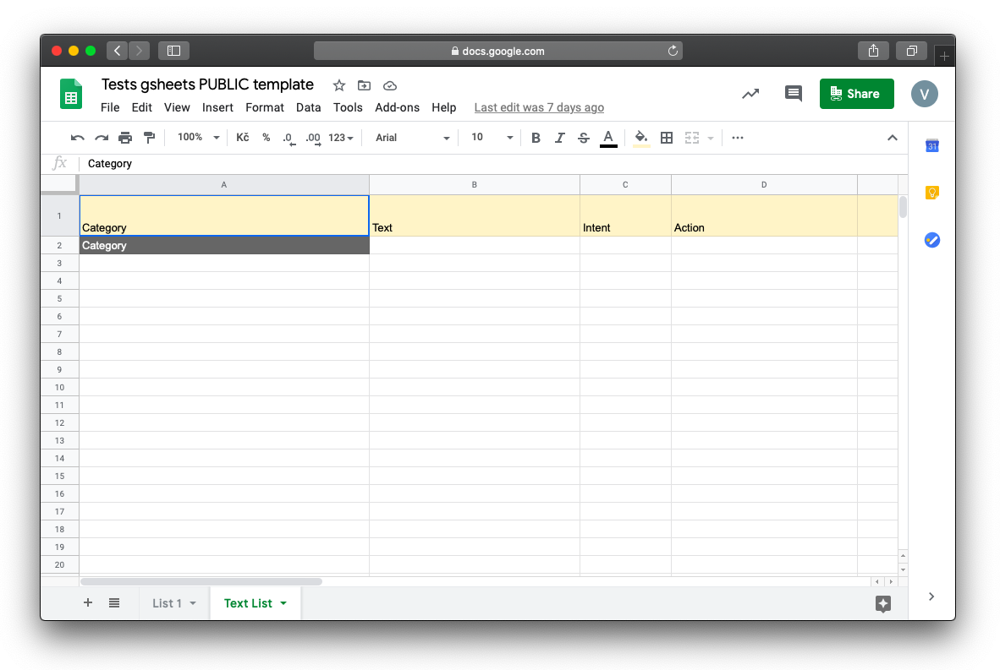

# Automated NLP tests - text sheet

If you are designing a chatbot and you expect that users will ask your chatbot directly (not going through some step-by-step procedure), you can test how well prepared is your NLP. You can simulate the user's behavior with another type of automated test.

This can be useful in the case of customer care or internal bots.

**Preparation of a test**

As we mentioned in another part of Wingbot’s documentation, you can download a template for automated tests. The second sheet is called the Text list. Its structure looks like this:

**What do those columns mean?**

- Category - Similarly to conversation automated test, in this helper column, you can divide the automated test into several different categories (for example key interactions to which utterances should lead)
- Text - That is a space for you to test an utterance. Here try to come up with as many examples as possible
- Intent - Here you write the exact name of an intent that NLP should identify
- Action - Here you define, where your specific utterance should lead

>Only the text column is mandatory to fill. When you leave other columns empty, the test will let you know, how every text input is classified - which intent was detected.

This is how should a Text List sheet look like:

When your sheet is prepared, execute the test:

Let’s look at the results:

At first, you can see the problematic utterance, in the next column you see with which confidence NLP sees your utterance in the intent. Perceived intent is in the next column. Next to it, you can see to which interaction given utterance should have led and where it leads actually.

This tool can warn you if some of your utterances are completely false, or if they lead to another interaction or if the interaction is missing.
